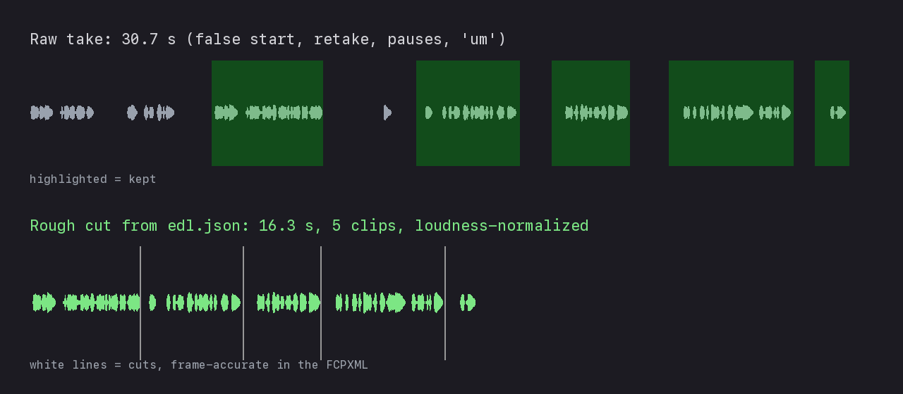
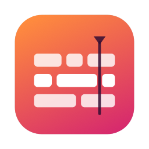
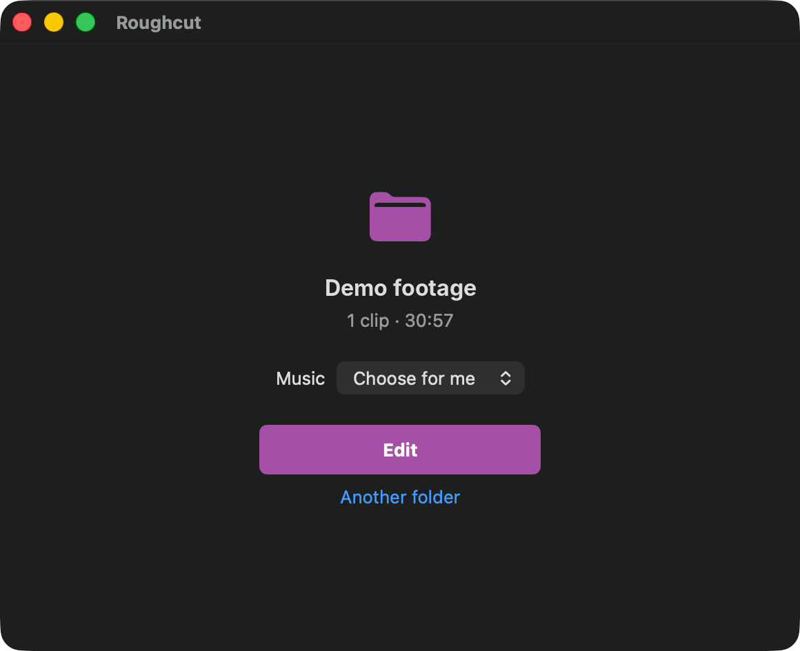
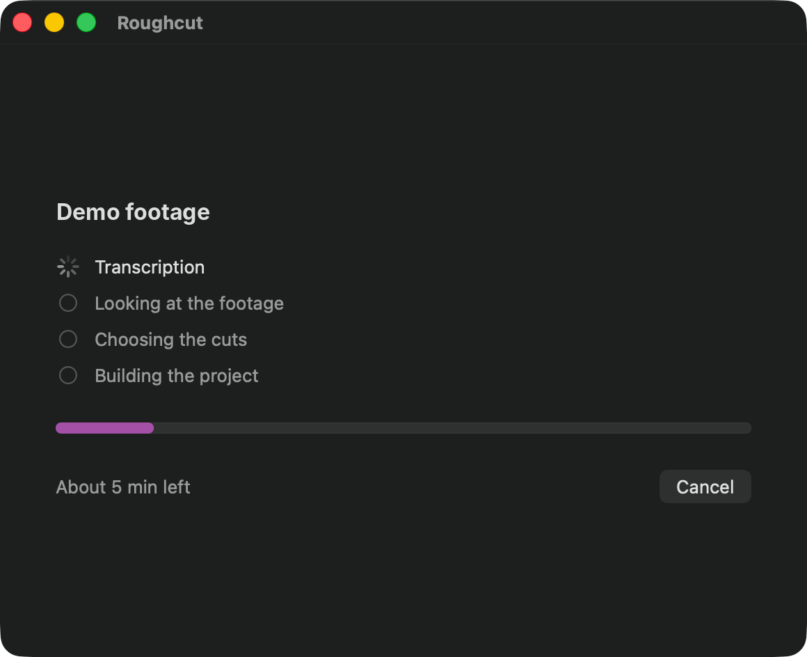
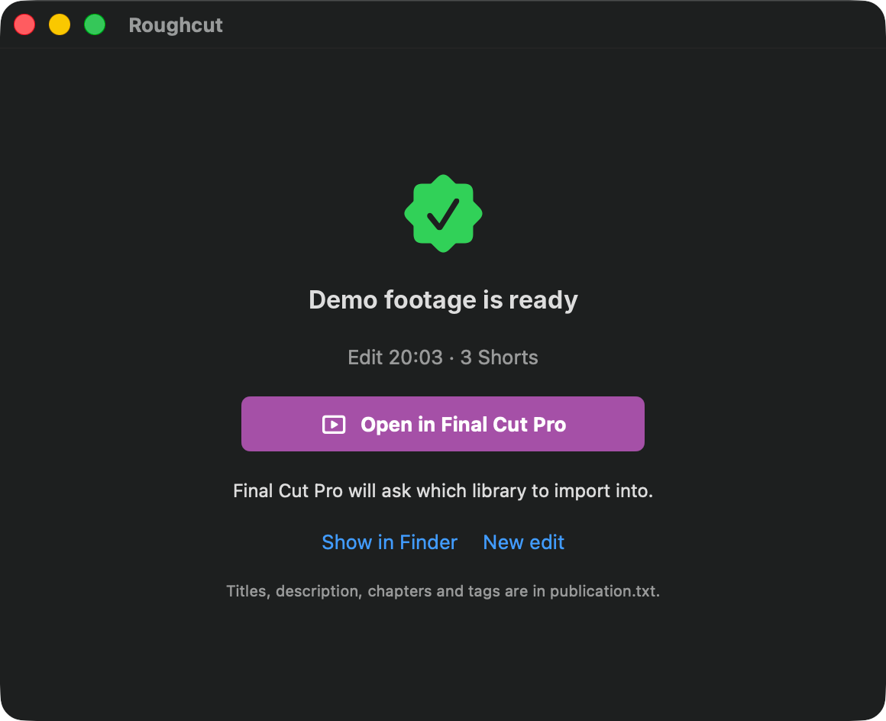
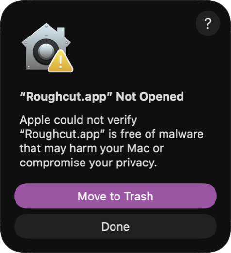
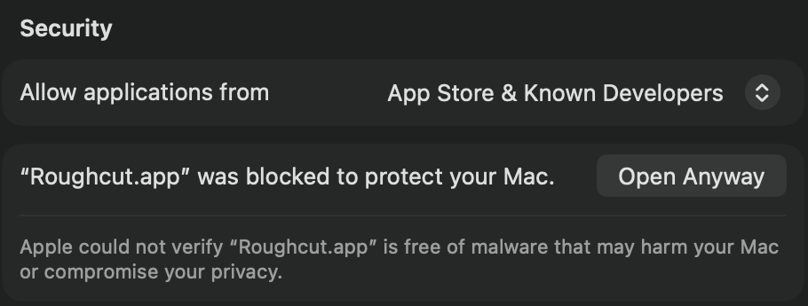
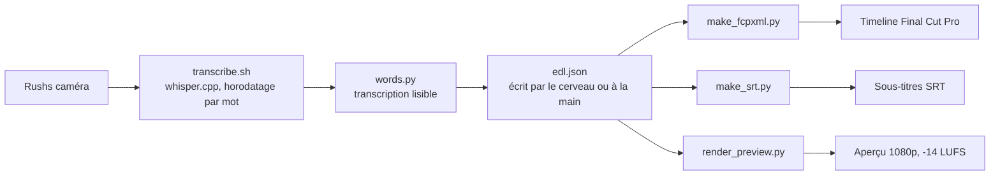

# fcpxml-roughcut

[](https://github.com/Bouliw/fcpxml-roughcut/actions/workflows/tests.yml)

[English version](README.md)

Dérusher une vidéo face caméra en ligne de commande, puis finir le montage dans Final Cut Pro. Whisper transcrit chaque mot avec son horodatage, un agent IA (ou vous) écrit les coupes dans un petit `edl.json`, et les scripts en tirent une timeline FCPXML à l'image près, des sous-titres SRT et un aperçu normalisé en loudness.



- **À l'image près** : chaque coupe tombe sur une image exacte, grâce à des calculs en temps rationnel (29,97 i/s et 59,94 i/s gérés sans approximation), et le timecode de la caméra est conservé.
- **Vérifié avec la spécification d'Apple** : chaque FCPXML est validé avec la DTD fournie dans le Final Cut Pro installé avant d'être utilisé, et `--open` l'envoie directement dans Final Cut Pro.
- **En local** : la transcription tourne sur le Mac avec whisper.cpp. Aucun rush n'est envoyé en ligne.
- **Le monteur garde la main** : on obtient un projet Final Cut Pro normal, prêt pour les plans de coupe, la musique et l'étalonnage.

## L'app : Roughcut

<p align="center"></p>

Roughcut est l'app Mac autour de ces scripts : on glisse un dossier de rushs, on clique sur **Monter**, on ouvre le résultat dans Final Cut Pro. Rien d'autre à installer : ni Terminal, ni Homebrew.

<p align="center">
  
  
  
</p>

### Installation

1. Télécharger `Roughcut-<version>.dmg` depuis la [dernière version publiée](https://github.com/Bouliw/fcpxml-roughcut/releases/latest), l'ouvrir et glisser Roughcut dans Applications.
2. Ouvrir Roughcut. L'app n'est pas encore signée par un développeur identifié : la première fois, macOS la bloque. Cliquer sur **Terminé**.

   
3. Ouvrir **Réglages Système › Confidentialité et sécurité**, descendre jusqu'à **Sécurité** et cliquer sur **Ouvrir quand même**, puis confirmer avec votre mot de passe. macOS s'en souvient : ensuite, Roughcut s'ouvre comme n'importe quelle app.

   
4. Le premier lancement tient en trois écrans : qui fait les choix de montage (Claude Code, détecté et vérifié connecté ; LM Studio ou Ollama, détecté ouvert ; ou une clé d'API, rangée dans le trousseau macOS), la langue que vous parlez le plus dans vos vidéos (les passages dans une autre langue sont écrits tels qu'ils sont dits) et votre dossier de musiques (facultatif), et les téléchargements : les outils de montage (52 Mo) et le modèle de transcription (large-v3-turbo, 1,6 Go, sauf si un modèle Whisper est déjà sur le Mac).

La première fois qu'un montage lit des rushs sur le Bureau, dans Documents ou dans Téléchargements, macOS demande si Roughcut peut y accéder : accepter.

Il faut un Mac Apple silicon, macOS 14 ou plus récent, Final Cut Pro (la version d'essai gratuite suffit) et environ 3 Go libres. Roughcut a été testée sur macOS 26.5. Elle est construite pour macOS 14 : la construction s'arrête si l'app ou l'un de ses outils exige un macOS plus récent ou n'a pas de code Apple silicon, et les compilateurs signalent toute fonction d'un macOS plus récent utilisée sans vérification ; elle n'a pas encore tourné sur macOS 14 ou 15.

### Utilisation

Glisser le dossier sur la fenêtre (ou sur l'icône du Dock), choisir la musique, cliquer sur **Monter**. La fenêtre affiche les quatre étapes (transcription, analyse des images, choix des coupes, génération du projet), une barre de progression, le temps restant, estimé d'après la durée des rushs et affiné à chaque montage, et **Annuler**. On peut fermer la fenêtre : l'icône de la barre des menus suit le montage, et une notification prévient quand c'est prêt. **Ouvrir dans Final Cut Pro**, choisir une bibliothèque : un seul événement contient les rushs rangés, le montage et les Shorts verticaux (jusqu'à trois, chacun tiré d'un moment différent). Titres, description, chapitres et tags sont dans `publication.txt` (**Afficher dans le Finder**).

Réglages (⌘,) : le cerveau, le dossier de musiques, le niveau de la musique sous la voix, les zooms, le nombre de Shorts (aucun à trois). Le reste est dans les Paramètres avancés : dossier des projets, modèle de transcription, langue parlée, bibliothèque à rappeler, langue de l'app, vitesse de téléchargement (une limite laisse la connexion utilisable pendant le téléchargement du modèle), et `roughcut.json` pour tout le reste.

### La construire soi-même

Avec les seuls Command Line Tools (sans Xcode) :

```bash
app/runtime/build_runtime.sh   # les outils du moteur, depuis des sources figées et vérifiées (environ 15 min)
app/build_app.sh               # build/Roughcut.app et build/Roughcut-<version>.dmg
```

Les outils du moteur sont publiés une seule fois, avec la version nommée dans `app/runtime/versions.sh` (`RUNTIME_RELEASE`, `RUNTIME_SHA`) : les versions suivantes de l'app les téléchargent de là et les vérifient.

La signature est ad hoc pour l'instant. Avec un Developer ID Apple, `SIGN_IDENTITY="Developer ID Application: …" app/runtime/build_runtime.sh` signe chaque binaire des outils, et `SIGN_IDENTITY=… NOTARY_PROFILE=… app/build_app.sh` signe l'app avec le runtime renforcé, puis fait notariser et agrafe l'image disque (`xcrun notarytool store-credentials` crée le profil) : l'étape « Ouvrir quand même » disparaît.

### Ce qu'elle télécharge, et les licences

L'app et les scripts sont sous licence MIT. Les outils du moteur, téléchargés au premier lancement, gardent leurs propres licences, qui permettent toutes de les distribuer à côté de code MIT. Le dossier `licenses` de l'archive contient chaque texte de licence et les sources exactes des outils.

| Composant | Licence | Usage |
|---|---|---|
| ffmpeg et ffprobe 8.1 | LGPL 2.1 ou ultérieure : compilés sans aucune partie GPL ni non libre | programmes séparés, sources et script de compilation publiés |
| FreeType, FriBidi, HarfBuzz, libass | FreeType License, LGPL 2.1+, MIT, ISC | dans ffmpeg, pour les sous-titres |
| whisper.cpp 1.9 | MIT | programme séparé |
| Whisper large-v3 et large-v3-turbo | MIT (OpenAI) | téléchargés depuis Hugging Face |
| Python 3.12 ([python-build-standalone](https://github.com/astral-sh/python-build-standalone)) | PSF License, et celles des bibliothèques qu'il intègre | fait tourner les scripts |
| numpy, PyObjC, le SDK Anthropic et leurs dépendances | BSD, MIT, Apache 2.0, PSF | paquets Python |

OpenCV est volontairement absent : ses paquets pour macOS embarquent une version GPL de FFmpeg (x264, x265). Les quelques opérations d'image dont l'analyse avait besoin sont écrites avec numpy.

Mentions complètes : [THIRD_PARTY_NOTICES.md](THIRD_PARTY_NOTICES.md), aussi dans l'app (À propos de Roughcut, et `THIRD_PARTY_NOTICES.txt` dans ses Resources).

### Mettre à jour

Télécharger le nouveau `Roughcut-<version>.dmg` dans les [versions publiées](https://github.com/Bouliw/fcpxml-roughcut/releases) et glisser Roughcut dans Applications en remplaçant l'ancienne. Réglages, projets, outils et modèle de transcription sont gardés : rien n'est retéléchargé, sauf si une version annonce que les outils ont changé. Avec la signature ad hoc, macOS redemande une fois de confirmer l'ouverture (Ouvrir quand même) et, si les rushs sont sur le Bureau, d'autoriser l'accès. Quand une nouvelle version sort, une ligne en haut de la fenêtre et dans le menu de la barre des menus le dit et y mène : Roughcut consulte la liste des versions sur GitHub une fois par jour.

### Où elle range ses fichiers, et la désinstaller

| Quoi | Où |
|---|---|
| L'app | `/Applications/Roughcut.app` |
| Les outils et le modèle de transcription (environ 1,8 Go) | `~/Library/Application Support/Roughcut` |
| Les réglages de l'app | `~/Library/Preferences/io.github.bouliw.roughcut.plist` |
| Les projets, leurs réglages (`roughcut.json`) et un cache de transcriptions et de mesures (`.cache`, quelques Mo par dossier de rushs) | `~/Movies/Roughcut` (ou le dossier des projets choisi dans les Réglages) |
| Une clé d'API, si elle a été enregistrée | le trousseau, élément `fcpxml-roughcut` (Trousseaux d'accès) |
| Un modèle Whisper partagé avec les scripts, s'il y en a un | `~/.cache/whisper-cpp` |

Pour désinstaller : quitter Roughcut (icône de la barre des menus › Quitter), glisser l'app dans la corbeille, puis dans le Finder (Aller › Aller au dossier…) mettre à la corbeille `~/Library/Application Support/Roughcut` et `~/Library/Preferences/io.github.bouliw.roughcut.plist`, et supprimer l'élément `fcpxml-roughcut` dans Trousseaux d'accès si une clé d'API a été enregistrée. Le dossier des projets contient vos montages : le garder, ou le supprimer quand ils ne servent plus (Final Cut Pro y lit les sous-titres des Shorts). Son dossier `.cache` peut être supprimé à tout moment ; le prochain montage des mêmes rushs prend simplement plus de temps.

### Signaler un problème

Quand un montage s'arrête, la fenêtre dit pourquoi, en mots simples. **Signaler le problème** (aussi dans le menu de la barre des menus et le menu Aide) copie un rapport et ouvre avec lui un nouveau ticket GitHub : les versions de Roughcut, de son moteur et de macOS, le message, le détail technique et la fin de `montage.log`, sans votre dossier personnel ni votre nom. Relisez-le avant de l'envoyer : le journal contient aussi les noms de vos dossiers et de vos rushs. **Voir le journal** ouvre `montage.log` lui-même.

### Les rushs

- **Final Cut Pro**, version payante ou d'essai, 10.6 ou plus récent : le projet est écrit dans le FCPXML le plus récent que le Final Cut Pro installé sait importer (1.10 pour 10.6, jusqu'à 1.13 pour 11), lu dans l'app elle-même. Un Final Cut Pro plus ancien est signalé dès le premier écran.
- **HDR et 10 bits** (HLG, PQ) : chaque rush déclare son espace colorimétrique à Final Cut Pro, qui le convertit vers la timeline Rec. 709, le choix habituel pour YouTube. Pour une vidéo HDR, régler dans Final Cut Pro la bibliothèque en Wide Gamut HDR et le projet en Rec. 2020 HLG. Les rushs D-Log M paraissent fades tant qu'aucun LUT n'est appliqué : sélectionner les plans, puis Inspecteur › Infos › LUT de caméra (le LUT de DJI peut y être ajouté). L'analyse juge les rushs HLG et PQ sur l'image SDR que Final Cut Pro affiche sur une timeline Rec. 709 (ITU-R BT.2100 et BT.2408 : le blanc de référence HDR au blanc SDR, les hautes lumières adoucies), et ne compte comme surexposé que ce que la caméra elle-même a écrêté. Le D-Log M ne se reconnaît pas au fichier : avec `"quality": {"log_footage": true}` dans `roughcut.json`, chaque rush est converti avec la courbe D-Log publiée par DJI, une approximation de celle du D-Log M.
- **Disques externes** : ils fonctionnent (exFAT compris) ; macOS peut demander une fois si Roughcut peut utiliser les volumes amovibles. Garder le disque branché : Final Cut Pro y lit les rushs.
- **iCloud Drive** : les rushs pas encore téléchargés sont repérés avant le montage, avec la marche à suivre (clic droit › Télécharger maintenant).
- **Veille** : le Mac reste éveillé pendant un montage (pas écran rabattu). En mode Économie d'énergie, un montage prend simplement plus de temps.
- **Langues** : un rush qui mêle plusieurs langues (la narration dans l'une, une interview dans une autre) est transcrit avec chaque passage dans sa propre langue, avec le réglage « Plusieurs, détecte-la » comme avec une langue principale indiquée. Pour le changer ensuite : Réglages › Paramètres avancés.

### Accessibilité

La fenêtre suit l'apparence claire ou sombre du Mac et se redimensionne. Clavier : Retour lance le montage ou ouvre le résultat, Échap annule un montage, ⌘O choisit un dossier, ⌘, ouvre les réglages. VoiceOver lit la zone de dépôt, chaque étape avec son état, la progression et le cerveau choisi.

## Le problème

Le dérushage d'une vidéo face caméra, c'est l'étape la plus lente et la moins créative du montage : trouver la bonne prise, enlever les blancs, les « euh » et les faux départs, une coupe après l'autre. Dès qu'on a une transcription mot à mot, ce travail devient mécanique. L'outil fait le dérushage à partir de la transcription ; le travail créatif reste au monteur, dans Final Cut Pro.

## Comment ça marche



L'IA n'intervient qu'à l'étape du milieu. Le cerveau (Claude Code, un modèle local ou une clé d'API) lit la transcription, choisit les prises et écrit `edl.json` ; vous pouvez le relire avant que la timeline soit générée. Tout ce qui l'entoure est déterministe : les scripts se chargent du calcul des images, et un modèle n'a jamais à les compter.

## Prérequis

- macOS, puisque Final Cut Pro n'existe que sur ce système. Les scripts eux-mêmes n'ont besoin que de ffmpeg, whisper.cpp et Python.
- [Homebrew](https://brew.sh) : `brew install ffmpeg whisper-cpp`
- Python 3.9 ou plus récent, bibliothèque standard uniquement pour le dérushage ; `analyze.py` demande en plus numpy, et se sert d'Apple Vision (`pyobjc-framework-Vision`) s'il est là
- Un modèle Whisper, 1,6 Go pour large-v3-turbo :

```bash
mkdir -p ~/.cache/whisper-cpp
curl -L -o ~/.cache/whisper-cpp/ggml-large-v3-turbo.bin \
  https://huggingface.co/ggerganov/whisper.cpp/resolve/main/ggml-large-v3-turbo.bin
```

Le modèle se choisit par variables d'environnement : `WHISPER_MODEL` (par défaut `ggml-large-v3-turbo.bin`) et `WHISPER_MODEL_DIR` (par défaut `~/.cache/whisper-cpp`). turbo est le modèle par défaut : sur du français, il donne les mêmes mots que large-v3 à 98 %, plus fidèle à ce qui est dit (large-v3 ajoute les « ne » qu'on ne prononce pas), trois fois plus vite. Si turbo manque mais que large-v3 est là, les scripts prennent large-v3 et le disent.

Une passe de Whisper garde une seule langue : avec le français indiqué, ou détecté sur les 30 premières secondes, une réponse en anglais sort traduite en français, ou supprimée. `transcribe.sh` (par `languages.py`) demande donc d'abord à Whisper la langue de chaque tranche de 30 s ; là où il n'est pas sûr, il redemande morceau par morceau, le son coupé à ses pauses. Quand plusieurs langues sont parlées, chaque passage est transcrit dans la sienne, coupé dans la pause où la langue change (au moment le plus calme quand la musique ne laisse pas de pause), et un bout de parole que Whisper a sauté est transcrit à nouveau. Un passage de moins de 15 s dans une autre langue que ceux qui l'entourent est transcrit dans les deux, et garde celle où Whisper l'écrit avec le plus d'assurance : seule, une phrase en français peut être prise pour de l'anglais (sur de vrais rushs, 0,89 contre 0,71 ; une réponse en anglais, 0,83 contre 0,48). La langue indiquée (`transcribe.sh clip sortie fr`) est la langue principale ; `auto` prend celle qui est parlée le plus longtemps. Sur une vidéo de test d'environ 30 minutes qui alterne deux langues, il a trouvé chaque changement de langue, récupéré une réponse qu'une passe unique avait supprimée, et aucune trace de la phrase qu'une passe unique répétait 20 fois sur une autre réponse ; la transcription a pris 119 s au lieu de 85 s. Avec une seule langue, c'est une passe unique, comme avant, après environ 35 s par heure de rushs pour vérifier la langue (M4 Max).

```bash
git clone https://github.com/Bouliw/fcpxml-roughcut.git
cd fcpxml-roughcut
scripts/check_env.sh   # liste ce qui manque, n'installe rien
```

## Essayer sur un clip généré

`examples/make_demo_clip.sh` fabrique une fausse prise de 30 secondes : une voix de synthèse (`say` de macOS) sur une mire ffmpeg, en 1080p à 29,97 i/s avec un timecode 01:00:00:00. La voix fait un faux départ, reprend, marque des pauses et hésite, comme dans une vraie première prise. Les coupes de ce clip sont déjà écrites dans [`examples/edl.json`](examples/edl.json).

```bash
examples/make_demo_clip.sh
cd examples
../scripts/transcribe.sh demo/talking-head.mp4 demo/transcripts en
python3 ../scripts/words.py demo/transcripts/talking-head.json
python3 ../scripts/make_fcpxml.py edl.json -o demo/demo.fcpxml --open
python3 ../scripts/make_srt.py edl.json -o demo/demo.srt --transcripts demo/transcripts
python3 ../scripts/render_preview.py edl.json -o demo/preview.mp4
```

L'agent écrit les coupes à partir de cette transcription (`demo/transcripts/talking-head.txt`) :

```
[00:00.05–00:03.00] Hi everyone, today we're going to...
[00:03.00–00:05.24] No, let me start again.
        (pause 1.4 s)
[00:06.68–00:10.54] Hi everyone, today I'll show you how to edit a video from the terminal.
        (pause 2.0 s)
[00:12.52–00:13.08] [Um.]
        (pause 1.0 s)
[00:14.12–00:17.68] First, Whisper transcribes every word with its timestamp.
        (pause 1.3 s)
[00:19.02–00:21.64] Then the cuts are written to a JSON file.
        (pause 1.6 s)
[00:23.28–00:27.56] And the script builds a Final Cut Pro timeline, accurate to the frame.
        (pause 1.0 s)
[00:28.58–00:29.62] Your turn.
[00:30.05–00:59.98] {Thank} {you.}
```

La dernière ligne est une hallucination de Whisper sur la seconde de silence finale : personne ne dit « Thank you ». `words.py` met entre accolades tout mot qui dure plus de 3 secondes, signe habituel d'un texte inventé sur du silence ; la personne ou l'agent qui lit la transcription ne le reprend pas dans `edl.json`. Deux autres habitudes de Whisper sont signalées. Plusieurs mots qui partagent un même horodatage prennent un `≈` devant le premier : après une longue pause, c'est de la vraie parole dont le minutage est perdu, il faut donc y garder une marge plus large. Quand une telle série de cinq mots ou plus répète ce qui vient d'être dit, c'est du texte que Whisper a écrit deux fois, et il passe lui aussi entre accolades. Les mots entre accolades n'arrivent jamais dans les sous-titres.

```
demo/demo.fcpxml
Total duration: 0:16 (16.32 s, 489 frames at 29.970 fps) | 5 clips | format 1920x1080
DTD check: valid against the FCPXML 1.13 DTD of Final Cut Pro
Opened in Final Cut Pro: the import starts there.
demo/demo.srt: 8 subtitles, 46 words
demo/preview.mp4: 16.32 s (expected 16.32 s, difference +0.00 s)
```

`--open` confie le fichier à Final Cut Pro, ou à Final Cut Pro Trial si c'est lui qui est installé (`FCP_APP` désigne une autre app). Final Cut Pro demande alors dans quelle bibliothèque importer : c'est le seul clic. Sans `--open` : **Fichier › Importer › XML**. Sous-titres : **Fichier › Importer › Sous-titres**. Les rushs doivent rester là où ils étaient quand le FCPXML a été généré.

Le FCPXML est en version 1.13 (Final Cut Pro 11 et suivants). `--fcpxml-version 1.10` écrit la même timeline pour Final Cut Pro 10.6 et suivants. Une fois le fichier écrit, `make_fcpxml.py` le valide avec `xmllint` contre la DTD de cette version trouvée dans l'app Final Cut Pro, et s'arrête en cas d'échec. Le même contrôle marche sur n'importe quel FCPXML, y compris un export de Final Cut Pro (paquets `.fcpxmld` compris) : `scripts/fcp.py check fichier.fcpxml`.

Vérifié sur cette démo :

- Validation avec le `FCPXMLv1_13.dtd` du bundle de Final Cut Pro 11.2, et avec les versions 1.10 à 1.12 via `--fcpxml-version` : valide.
- `--open` avec Final Cut Pro Trial 11.2 : l'import se lance.
- Loudness intégrée de l'aperçu : -13,8 LUFS pour une cible de -14 LUFS (-14,1 LUFS sur un vrai Short de 58 secondes).
- Whisper relancé sur l'aperçu : tous les mots reviennent intacts, aucune coupe ne mange donc de syllabe.

## Un clic depuis le Finder

`install_quick_action.py` ajoute une action rapide au Finder : clic droit sur un dossier de rushs > Actions rapides > Monter ces rushs. Elle lance `auto_edit.py` sur ce dossier en arrière-plan : transcription, analyse de l'image, choix de montage, niveaux des voix, zooms, J-cuts et L-cuts, plans de coupe, musique, Shorts verticaux avec sous-titres animés et les rushs rangés, le tout dans **un seul FCPXML avec un seul événement**, nommé d'après le dossier, la date et l'heure : Final Cut Pro demande une bibliothèque une seule fois et ne propose jamais de garder les deux. Une notification prévient quand c'est prêt, et le fichier s'ouvre dans Final Cut Pro. La seule question porte sur la musique, au début, pour que le reste tourne seul (le dossier de morceaux est demandé une fois ; sans réponse au bout de 10 minutes, le premier choix est pris).

```bash
python3 scripts/install_quick_action.py --name "Monter ces rushs" --app /Applications/Roughcut.app
```

Avec `--app`, l'action rapide utilise le moteur de l'app Roughcut installée : ses outils, son modèle de transcription et sa langue, son dossier des projets. Le Finder et l'app montent donc de la même façon, et mettre l'app à jour met les deux à jour. Le même lanceur fait tourner n'importe quel script à la main : `bash /Applications/Roughcut.app/Contents/Resources/engine/roughcut make_fcpxml.py edl.json -o projet.fcpxml` (`--version` dit lequel). Sans `--app`, l'action rapide lance les scripts de ce dossier avec le Python donné (`--python`, `--work-dir`).

Les coupes se font aussi à l'intérieur de ce qui est gardé, pas seulement entre les phrases. Les horodatages de Whisper débordent sur les silences : `words.py --audio rush` recale donc les mots sur les pauses entendues dans le son (`pauses.py`) ; une phrase de plus de 12 s est ensuite coupée là où l'on reprend son souffle, pour que le cerveau puisse n'en garder qu'une partie ; enfin les blancs, les hésitations et les mots redits aussitôt (« on est allés, on est allés au lac ») sont retirés de chaque passage gardé. Le cerveau apprend combien de temps a été dit et doit viser environ la moitié : il retire ce qui répète une idée, les commentaires sur ce que montre la caméra, les bavardages et les impasses, mais garde les blagues, la question qui mène à une réponse qu'il garde, et finit le montage sur une phrase qui le conclut. Sur une vidéo de test d'environ 30 minutes, le montage est passé de 18-20 minutes à 14-15. Une fois le montage assemblé, il est relu comme le ferait un spectateur (`review.py`) : le cerveau reçoit ce que dit le montage, ligne par ligne, à côté de ce qui a été coupé, et corrige ce qui ne se suit pas (une référence à un passage coupé, un nouveau lieu sans rien pour montrer le trajet, une question sans réponse ou une réponse sans question) en remettant une ligne ou un plan, ou en retirant une ligne. Il ajoute au plus un dixième du montage, en retire autant au plus, ne change jamais l'ordre, et ses ajouts portent un marqueur dans Final Cut Pro ; une nouvelle version faite avec `--decisions` ne demande rien au cerveau et reprend la relecture enregistrée avec les choix. Les Shorts sont les passages les plus forts de la vidéo, chacun un seul sujet raconté par une seule personne, jusqu'à trois (`auto.short`), au plus un par tranche de 2 min 30 de parole pour qu'une vidéo courte ne soit pas découpée en entier, chacun tiré d'un moment qui lui est propre et dans son propre projet avec ses propres sous-titres. Un Short qui puise dans l'ouverture (l'introduction) est remplacé par un Short construit autour de l'accroche, ou tiré de la minute la plus dense qu'aucun autre Short ne contient. Sans dossier de musiques, le dossier est demandé ; si la question ne peut pas s'afficher, la notification dit que le montage est sans musique, et pourquoi.

Un rush sans son sert de plan de coupe, sans être transcrit, et n'importe quel nom de dossier fonctionne (accents, emojis, guillemets). Quand quelque chose échoue, la notification dit en mots simples à quelle étape, et le détail va dans `montage.log`. Un montage arrêté ou interrompu se relance tel quel : ce qui est déjà transcrit et mesuré est gardé, et deux montages des mêmes rushs en même temps le partagent sans risque.

Tous les réglages sont dans le `roughcut.json` du dossier de travail. Une nouvelle version (plus courte, une autre accroche, un passage retiré) part du `brain-answer.json` d'une version, modifié : `auto_edit.py rushs --decisions modifie.json`. Transcriptions et analyse sont gardées : cela prend environ une minute.

## Le cerveau

Seuls les choix de jugement passent par un modèle de langue : les prises à garder, l'accroche et les chapitres, la place des plans de coupe, les extraits des Shorts, les titres, la description et les tags. Transcription, analyse d'image, son et FCPXML marchent de la même façon quel que soit le cerveau. Il se choisit une fois, au premier lancement (une question, trois options), et se change ensuite dans `roughcut.json` (`brain.engine`) :

| Cerveau | Qualité | Coût | Confidentialité |
|---|---|---|---|
| `claude` : Claude Code (`claude -p`) | La meilleure | Compris dans un abonnement Claude | Les transcriptions partent chez Anthropic |
| `local` : tout serveur compatible OpenAI (LM Studio, Ollama) | Bonne avec un modèle de la classe 30B | Gratuit | Rien ne quitte le Mac |
| `api` : une clé Anthropic ou OpenAI | Très bonne | Payé à l'usage | Les transcriptions partent chez le fournisseur |

Les clés d'API vont dans le trousseau macOS (`python3 scripts/brain.py set-key anthropic`), jamais dans un fichier. Quand Claude ne répond pas (quota atteint), le cerveau local prend le relais s'il est réglé (`brain.local_model`), et la notification le dit ; quand rien ne répond, toute la parole est gardée dans l'ordre. Sur un Mac de 36 Go, Qwen 3.6 35B-A3B (MLX 4 bits, 20 Go) fait un bon cerveau local : seuls 3 milliards de ses paramètres travaillent pour chaque mot, il reste donc rapide.

Ce que reçoit le cerveau, quel qu'il soit : un texte avec les transcriptions (chaque phrase avec ses temps), les noms des rushs, les passages jugés inutilisables et pourquoi, et les plans de coupe repérés, avec les étiquettes qu'Apple Vision leur a données (« outdoor, people »). Aucune image, aucun son, aucune vidéo, aucun chemin de fichier. Avec `claude` et `api`, ce texte part chez Anthropic (ou OpenAI), selon leurs conditions ; avec `local`, il reste sur le Mac. `brain-prompt.txt`, dans chaque dossier de projet, est exactement ce qui a été envoyé. En dehors du cerveau, l'app contacte GitHub (pour télécharger ses outils une fois, et une fois par jour pour voir si une nouvelle version existe) et Hugging Face (le modèle de transcription, une fois) ; elle n'envoie rien sur vous ni sur vos rushs, et il n'y a aucune mesure d'audience.

## Le format edl.json

```json
{
  "project": "Weekend vlog",
  "vertical": false,
  "clips": [
    {"file": "footage/C0007.MP4", "in": 83.12, "out": 91.40, "chapter": "Hook", "note": "strongest line"},
    {"file": "footage/C0001.MP4", "in": 0.42, "out": 12.95, "chapter": "Arrival"},
    {"file": "footage/C0001.MP4", "in": 14.10, "out": 31.77, "marker": "B-roll here"}
  ],
  "markers": [{"at": 45.0, "text": "punch-in zoom to hide the cut"}]
}
```

| Champ | Obligatoire | Rôle |
|---|---|---|
| `clips` | oui | Les coupes dans l'ordre de la timeline. Une même source peut revenir autant de fois que nécessaire. |
| `clips[].file` | oui | Fichier source : chemin absolu, `~/...` ou relatif à `edl.json`. |
| `clips[].in`, `out` | oui | Secondes dans la source, lues dans la transcription. Les scripts les calent sur les images. |
| `clips[].chapter` | non | Marqueur de chapitre au début du clip (chapitres YouTube). |
| `clips[].marker` | non | Marqueur au début du clip. |
| `broll` | non | Plans de coupe à poser sur le montage : `{"file", "in", "out", "at_source" ou "at", "note"}` (voir Plans de coupe plus bas). |
| `music` | non | Morceau sous le montage : `{"file", "in", "at", "duck", "snap_broll"}` (voir Musique plus bas). |
| `clips[].role` | non | Rôle audio dans Final Cut Pro : `dialogue` (par défaut), `music` ou `effects`. |
| `clips[].split`, `split_seconds` | non | Montage décalé au début de cette coupe : `j`, `l` ou `none`, et sa durée (avec `--split-edits`). |
| `clips[].note` | non | Texte libre pour qui écrit les coupes. Ignoré par les scripts. |
| `markers` | non | `{"at": seconds, "text": ...}` : un marqueur à un instant donné de la timeline. |
| `project` | non | Nom du projet dans Final Cut Pro (par défaut « Rough cut »). |
| `vertical` | non | `true` pour un Short en 1080×1920 ; les clips sont ajustés, puis agrandis pour remplir le cadre (importés en « fill », Final Cut Pro les laissait petits au milieu). |
| `format` | non | Impose le format du projet, par exemple `{"width": 3840, "height": 2160, "fps": "60000/1001"}`. Par défaut : celui du premier clip. |

L'agent n'a pas à calculer les marges lui-même. Il peut lister les phrases à garder, sous forme de plages de temps lues dans la transcription, et laisser `edl_from_ranges.py` écrire les coupes : il ne garde que les mots compris dans chaque plage, coupe la plage à chaque pause et à chaque hésitation, laisse de côté les mots entre accolades, et donne à chaque coupe une marge qui s'arrête à mi-chemin du mot suivant. `pause`, `pre` et `post` se règlent pour toute la liste ou pour une seule plage.

```json
{"project": "Weekend vlog", "file": "footage/C0001.MP4",
 "ranges": [{"from": 83.1, "to": 91.4, "chapter": "Hook"},
            {"from": 3.0, "to": 12.9, "post": 0.03, "note": "an um right after the last word"}]}
```

```bash
python3 scripts/edl_from_ranges.py ranges.json -o edl.json
```

Règles de coupe recommandées, pour la personne ou l'agent qui écrit `edl.json` :

- Couper entre les mots, environ 0,08 s avant le premier mot et 0,12 s après le dernier. En dessous, on mange des syllabes ; au-delà, les jump cuts traînent.
- Supprimer les blancs de plus de 0,5 s environ, les hésitations isolées et les faux départs. Quand une phrase est dite deux fois, garder la dernière prise.
- Ouvrir sur l'accroche (les 5 à 15 secondes les plus fortes), puis revenir à l'ordre chronologique.
- YouTube n'affiche les chapitres que si le premier commence à 0:00, qu'il y en a au moins 3 et que chacun dure 10 s ou plus. `make_fcpxml.py` le vérifie et affiche la liste des chapitres pour la description de la vidéo.

## Niveau des voix

`--level-audio` (sur `make_fcpxml.py` et `render_preview.py`) mesure la loudness de chaque coupe avec le mesureur EBU R128 de ffmpeg et écrit un gain par coupe dans le FCPXML (`adjust-volume`), vers un même niveau de voix. Rien n'est rendu : les gains sont des réglages de volume ordinaires, modifiables dans Final Cut Pro.

Les coupes d'une même source partagent un seul gain, calculé sur l'ensemble, pour que deux coupes d'une même prise ne sautent jamais de niveau. Une coupe n'a son propre gain que si elle s'écarte de sa source de plus de 2 LU (quelqu'un plus loin du micro, un cri) : mesurer 5 à 20 secondes de parole n'est précis qu'à 1 LU près environ. Les coupes de moins d'une seconde prennent le gain de leur source. Sur un vrai montage qui alterne un présentateur et plusieurs interviews, l'écart de niveau entre coupes est passé de 4,8 LU à 1,8 LU.

Les moments joués avec leur propre son (les moments IRL d'un vlog, rôle `effects`) vont vers -25 LUFS, sous la voix : sur de vrais rushs, ils allaient de -54 LUFS (une pièce calme) à -14 (du vent sur une route, plus fort que la voix). Un moment calme est remonté de 6 dB au plus, pour ne pas monter son souffle. `--fades` ajoute un fondu d'une ou deux images au son de chaque coupe, pour qu'aucune coupe ne claque ni ne fasse sauter l'ambiance, et d'un quart de seconde aux moments joués pour leur son, qui entrent et sortent en douceur sous la coupe franche de l'image. Gains et fondus sont de simples réglages de volume et poignées de fondu dans Final Cut Pro.

Là où le fond est bruyant, l'isolation de la voix de Final Cut Pro est posée sur la parole (`audio.voice_isolation`, auto par défaut) : sur un rush dont la voix dépasse le fond de moins de 25 dB, mesuré entre les mots (en marchant, au milieu des gens : 18 à 24 dB sur de vrais rushs ; une interview au calme : 40 à 46), à 40 %, modérée, jamais à fond. Elle passe dans le FCPXML en `adjust-voiceIsolation`, que Final Cut Pro applique à l'import (vérifié dans une bibliothèque : l'effet d'isolation d'Apple sur le plan), et se désactive là-bas plan par plan.

```
Dialogue levels (target -16 LUFS; a cut gets its own gain beyond 2 LU from its source):
  1  0:00  cut  -17.1  source  -19.4  gain +1.1dB
  2  0:16  cut  -19.7  source  -19.4  gain +3.4dB
  4  0:55  cut  -23.2  source  -19.4  gain +7.2dB
```

## Regarder les rushs

`analyze.py` prend trois images par seconde (avec l'image suivante de chacune, pour voir la caméra bouger) et mesure :

- la **netteté** : le détail de la partie la plus nette de l'image (variance du laplacien sur une grille de 4×4), pour qu'un visage net sur un fond doux ne passe pas pour un plan flou ;
- le **tremblé** : les changements brusques de vitesse de la caméra d'un échantillon à l'autre (corrélation de phase), pour qu'un panoramique régulier ne passe pas pour une secousse ;
- l'**exposition** : images noires, sous-exposées, part des hautes lumières brûlées ;
- avec Apple Vision sur macOS : les **visages** et leur qualité de capture, le **score esthétique** d'Apple et les **étiquettes de scène**, qui servent à deviner une caméra tournée vers le sol (des pieds dans l'image, ou une route sans rien de vertical).

Pour chaque clip, il écrit les plages à rejeter avec leur raison, les meilleurs moments de plans de coupe (sans parole, nets, stables, les plus beaux d'abord) et des images candidates pour la miniature, enregistrées en JPEG pleine taille. Les mesures sont gardées en cache : une deuxième passe, ou une passe avec d'autres seuils, les relit. Tout est une proposition tirée d'images échantillonnées, à vérifier dans le visualiseur.

```bash
pip install numpy pyobjc-framework-Vision   # Vision est facultatif, macOS seulement
python3 scripts/analyze.py footage/*.MP4 -o analysis --transcripts transcripts
```

Sur une vidéo de test 4K HEVC d'environ 30 minutes, l'analyse a pris 8 minutes sur un M4 Max, surtout pour décoder.

## Dérushage dans un événement Final Cut Pro

`organize.py` transforme l'analyse et les transcriptions en un événement à parcourir dans Final Cut Pro : des plages de mots-clés **Face cam** (parole sur un visage détecté) et **B-roll** (sans parole), un mot-clé **Place** tiré du GPS quand le clip en a un, les plages rejetées avec leur raison (à masquer avec le filtre du navigateur), des plages favorites sur les meilleurs moments de plans de coupe, et des marqueurs sur les images candidates pour la miniature.

```bash
python3 scripts/organize.py footage/*.MP4 -o logged.fcpxml --analysis analysis --transcripts transcripts --open
```

## Zooms sur les jump cuts

`--zoom-jump-cuts` (sur `make_fcpxml.py` et `render_preview.py`) agrandit une coupe sur deux dans une suite de coupes bout à bout d'une même source, à 112 % par défaut, pour qu'un jump cut se lise comme un changement de plan. Le zoom est ancré sur le visage trouvé par `analyze.py` : l'image se décale de -(s-1) fois la position du visage, le visage reste donc à sa place et aucun bord n'apparaît. Une nouvelle source repart à 100 % ; les coupes de moins d'une seconde, les coupes sans visage (un décor : un zoom centré y ressemblerait à une erreur) et les Shorts verticaux ne sont pas touchés, et le script le dit.

## J-cuts et L-cuts aux changements de scène

`--split-edits` (sur `make_fcpxml.py` et `render_preview.py`) transforme chaque coupe où la source change en montage son/image décalé : un J-cut fait commencer le son de la scène suivante avant son image, un L-cut fait déborder le son précédent sur l'image suivante (`audioStart` et `audioDuration` dans le FCPXML ; dans le scénario principal, ce qu'un son gagne, l'autre le cède). La durée, 0,6 s par défaut, est réduite, ou la coupe laissée droite, pour qu'aucun mot des transcriptions ne soit coupé ni ajouté : le son déplacé de part et d'autre de la coupe doit être libre de parole. « auto » tente un J-cut, puis un L-cut ; une coupe peut demander `"split": "j"`, `"l"` ou `"none"` et `"split_seconds"` dans `edl.json`. L'aperçu coupe l'image et le son là où Final Cut Pro les coupera.

## Plans de coupe (B-roll)

`broll.py` liste les plans vers lesquels couper : chaque passage d'un clip où personne ne parle, où personne ne fait face à la caméra la plupart du temps (une interview que la transcription a manquée) et où rien n'a été rejeté, avec les étiquettes de scène vues par Vision, le score esthétique et une image de son meilleur moment. Celui qui monte regarde les images, remplit une description et des tags dans `broll.json`, et rapproche les plans de ce que dit la transcription. Les plans choisis vont dans `edl.json` :

```json
"broll": [{"file": "footage/C0012.MP4", "in": 3.0, "out": 7.5, "at_source": 245.3, "note": "the lake"}]
```

`at_source` est un temps dans le clip face caméra, lu dans sa transcription : les scripts retrouvent où il est tombé dans le montage (`at` donne plutôt un temps de la timeline). Chaque plan devient un clip connecté au-dessus du face caméra, son son baissé à -96 dB avec le rôle Effets (on peut le remonter), avec un marqueur « B-roll : … » pour que chaque pose soit vérifiée. Les plans qui se chevauchent montent d'une piste ; les sous-titres passent au-dessus. L'aperçu montre le B-roll par-dessus l'image, et le face caméra reste audible.

## Musique

`music.py` donne le tempo et les temps forts de chaque morceau (librosa, ou celui de fcp-mcp-server via `uvx` quand librosa n'est pas installé ; en cache) et classe les morceaux d'un dossier pour un montage : assez longs d'abord, puis les plus proches de sa durée, puis un tempo dans la fourchette demandée. Le monteur choisit.

```bash
python3 scripts/music.py ~/Music/royalty-free --duration 480 --bpm 80-130
```

Dans `edl.json`, `"music": {"file": "music/track.mp3", "in": 30, "at": 0, "snap_broll": true}` pose le morceau sous le montage en clip audio connecté avec le rôle Musique. Son volume baisse sous chaque passage de parole tiré des transcriptions (images clés de volume, de -14 dB à -28 dB : la descente se termine quand la parole commence, la remontée suit sa fin, un blanc plus court que `min_gap_seconds` reste bas, et un blanc trop court pour les deux rampes ne remonte qu'en partie) ; avec `snap_broll`, chaque plan de coupe commence et finit sur le temps le plus proche, à 0,35 s près. L'aperçu mixe la musique de la même façon avant de normaliser la loudness.

## Shorts : cadrage qui suit le visage, sous-titres animés

Sur un Short vertical tiré d'images horizontales, seule une tranche de l'image se voit. `--follow-face` (sur `make_fcpxml.py` et `render_preview.py`) déplace cette tranche avec le visage trouvé par `analyze.py`, ou avec le sujet principal quand personne ne fait face à la caméra (le plus grand objet que trouve la saillance de Vision, s'il n'est pas l'image entière) : des images clés de position, une médiane sur cinq échantillons contre les détections parasites, une zone morte pour que le cadre reste immobile quand le visage bouge peu, une image clé de maintien avant chaque déplacement pour qu'il ne dérive jamais, et jamais au-delà du bord de l'image. Une coupe suit un visage quand un visage assez grand est là au moins la moitié du temps, sinon le sujet principal ; sans l'un ni l'autre, elle reste centrée.

`captions.py` écrit des sous-titres mot à mot façon Shorts (trois mots à l'écran, le mot prononcé surligné et un peu plus gros) dans un fichier `.ass`, et le rend avec libass en une vidéo transparente aussi longue que la timeline : du HEVC avec couche alpha, par l'encodeur du Mac, 40 fois plus léger que le ProRes 4444 pour la même image (ProRes là où il manque). `--overlay captions.mov` la pose sur toute la timeline en clip connecté avec le rôle Titres, et sur l'aperçu aussi. Police, couleurs, taille et position sont des réglages (`captions.*`) ; sur un Short vertical, les sous-titres restent au-dessus des boutons de l'application.

```bash
python3 scripts/captions.py edl.json -o captions.mov
python3 scripts/make_fcpxml.py edl.json -o short.fcpxml --follow-face --overlay captions.mov --open
```

## Habillage et sous-titres

Un seul réglage, `auto.dressing` (Habillage dans l'app), habille le montage principal avec ce que Final Cut Pro fait lui-même, pour que tout reste modifiable :

| Habillage | Ce que reçoit le montage |
|---|---|
| Aucun | Rien. |
| Léger (par défaut) | Un titre au début de chaque chapitre, et un fondu enchaîné pour y entrer. |
| Complet | Aussi l'heure du moment, un bandeau pour chaque personne interviewée, et des sous-titres animés sur le montage. |

- **Les titres** utilisent le Titre de base de Final Cut Pro avec son style ; seul le texte (le chapitre) est fixé. Un chapitre commence sur les moments IRL qui y mènent (le trajet vers le lieu), et quand le récit a des chapitres, sa première partie en a un (« Introduction » si le cerveau ne l'a pas nommée).
- **L'heure** (« 10h15 », « 10:15 AM ») s'affiche au début du récit, à un chapitre filmé 10 minutes ou plus après la dernière heure montrée, et là où l'horloge saute d'une demi-heure. Elle vient de la date qu'écrit un iPhone avec son fuseau horaire, sinon d'un nom comme `DJI_20260115101520_0001` ; une caméra qui n'écrit que l'heure UTC n'en affiche pas.
- **Les bandeaux** utilisent le Tiers inférieur de base, placé là où chaque personne interviewée répond pour la première fois (le cerveau le repère), avec « Prénom Nom » et « Pays » à taper : un nom entendu est trop souvent mal orthographié pour être écrit à votre place.
- **Les fondus** (une demi-seconde, image et son) ne sont posés que là où les deux plans ont l'image qu'il faut autour de la coupe ; ailleurs, la coupe reste franche, et le contrôle avant l'import refuse une transition sans image. Les J-cuts, L-cuts et petits fondus de son s'effacent à cet endroit.
- **Les sous-titres animés du montage** sont rendus en une bande de l'image (deux lignes de haut), en morceaux rendus côte à côte, placée en bas de l'image : six fois moins de pixels que l'image 4K entière, dont le rendu est limité par l'encodeur du Mac (22 minutes de 4K : moins de 5 minutes et 150 Mo, contre 23 minutes et 30 Go en ProRes). Police, taille, couleurs et hauteur se règlent à part pour le montage (`captions_main`) et pour les Shorts (`captions`).

Quel que soit l'habillage, `subtitles.py` écrit les sous-titres de chaque vidéo (le montage et chaque Short) pour YouTube : `subtitles.<langue>.srt` dans la langue des rushs et en anglais (`subtitles.languages`), chacun couvrant tout ce qui est dit, un passage dans une autre langue traduit par le cerveau (une réponse en anglais dans le fichier français, une question en français dans l'anglais, une troisième langue dans les deux). La langue de chaque ligne est devinée à ses mots, le cerveau la corrige. Il corrige aussi les fautes évidentes de la transcription (majuscules, apostrophes, espaces : « paris », « il ya »), et liste les mots à vérifier à l'écoute dans `to-check.txt` et en marqueurs « à faire » dans Final Cut Pro : un nom propre dont l'orthographe n'est pas sûre, un mot qui ne colle pas (« the whether was nice » : « weather »). Un mot n'est jamais changé sans une personne.

`captions.txt`, dans le dossier de chaque vidéo, contient le texte des sous-titres : corriger un mot, puis **Regénérer les sous-titres** (dans la barre des menus, ou une fois le montage fini ; `subtitles.py projet --regenerate`). La correction est gardée avec la transcription (`corrections.json`) : toutes les vidéos des mêmes rushs et toutes les versions suivantes l'ont ; les sous-titres animés sont rendus à nouveau à la même place, seulement les morceaux qui changent, et les SRT réécrits, seules les lignes changées étant redemandées au cerveau.

```bash
python3 scripts/subtitles.py "dossier du projet"                 # fichiers SRT, to-check.txt, captions.txt
python3 scripts/subtitles.py "dossier du projet" --regenerate    # après une correction dans captions.txt
python3 scripts/make_fcpxml.py edl.json -o montage.fcpxml --dressing full --overlay captions.json
```

## Hésitations, coupes sur les silences, et montage réécouté

Whisper efface les hésitations : sur 47 minutes de vrais rushs, il en a écrit 8 pour 5 658 mots. Deux méthodes travaillent ensemble (`cuts.hesitations`, Réglages › Paramètres avancés) :
- Whisper est lancé sur un texte plein d'hésitations (« euh… donc, euh, voilà » en français, « um, uh, so » en anglais), pour qu'il les écrive ; il ponctue aussi mieux et écrit de la parole qu'il sautait (437 mots de plus sur les mêmes rushs). Là où il répète ce texte sur un silence, ces mots sont marqués comme inventés.
- `hesitations.py` lit le son lui-même toutes les 10 ms (niveau, sifflantes au-dessus de 2 kHz, voix et hauteur) et trouve les voyelles tenues sur une note entre deux mots : une hésitation écrite par Whisper prend la place où elle s'entend, et celle qu'il a oubliée est ajoutée. Une voyelle dans un mot, ou à son début, fait partie de ce mot ; seule la fin étirée d'un mot (« et… euh ») compte.

Sur les mêmes rushs : 124 hésitations trouvées (109 écrites par Whisper et entendues, 15 entendues seulement). 9 seulement ont un vrai silence des deux côtés ; la plupart touchent les mots, sans silence où couper. Chaque coupe est donc contrôlée, et une hésitation qui échoue reste en place (`cuts.hesitations` : `none`, `clean` pour les seules nettes, `all`, par défaut, pour toutes celles qui passent) :
- celle qui laisserait un mot ou deux seuls entre deux coupes reste : elle casserait la phrase ;
- celle collée aux mots est coupée au creux du son, seulement si le raccord sonne comme deux mots dits à la suite : niveau et timbre juste avant et juste après pas plus éloignés que dans 9 enchaînements naturels sur 10 (13,6 dB et un écart de spectre de 1,25, mesurés sur 2 425 d'entre eux dans de vrais rushs) ;
- une fois le montage assemblé, les mots de part et d'autre d'un tel raccord doivent s'entendre en entier ; sinon l'hésitation revient.

Chaque bord de coupe est ensuite posé dans un vrai silence entendu dans le son, contre le mot qu'il commence ou finit, jamais sur une hésitation voisine : les repères de Whisper ne sont qu'un guide (un mot commence souvent un peu avant). Là où aucun silence ne s'entend (musique, bruit), le moment le plus calme.

Une fois assemblée, chaque vidéo est réécoutée (`verify_edit.py`, `cuts.verify`) : son son, tel que Final Cut Pro le joue, est retranscrit et comparé à ce qui devait être gardé. Une hésitation encore entendue est coupée là où le son du rush tient une voyelle à l'écart de tout mot, aux mêmes conditions que plus haut (dans des silences, ou avec un raccord qui passe les contrôles) ; un mot à garder coupé au bord d'un plan fait reculer ce bord jusqu'au silence d'après ; un bout de mot coupé, entendu au bord, est retiré. Puis à nouveau (`cuts.verify_rounds`, 3 fois au plus), une correction n'étant jamais tentée deux fois, avec retour aux meilleures coupes si une écoute a empiré. Un raccord qui échoue à la dernière écoute est quand même défait, et le montage est réécouté une fois de plus, seulement pour caler ses mots. Les mots sont alors calés sur le son du montage lui-même (`final-words.json`) : les sous-titres animés et les SRT le suivent, pas les repères lus dans les rushs. `to-listen.txt` liste ce qui a été contrôlé, et où : hésitations coupées (dans des silences, ou collées aux mots avec leur raccord contrôlé), hésitations laissées, corrections.

## Montage par le texte

Une fois un montage fini, **Montage par le texte** (dans la fenêtre, ou la barre des menus pour un montage plus ancien) affiche la transcription de tous les rushs : les mots du montage en noir, les passages coupés en gris. Un clic sur un mot le retire (barré) ou remet un mot gris ; un clic sur l'heure d'une ligne agit sur toute la ligne. **Mettre à jour dans FCP** crée une nouvelle version du montage à partir des mots choisis (`text_edit.py`, puis `auto_edit.py --decisions`) : les coupes sur les silences, la réécoute, les sous-titres et les SRT sont refaits, sans rien demander au cerveau. Les retouches faites à la main dans Final Cut Pro ne sont pas reprises : le montage par le texte se fait avant la finition, comme la fenêtre le rappelle.

```bash
python3 scripts/text_edit.py export "dossier du projet"               # text.json : chaque mot, et où il est
python3 scripts/text_edit.py apply "dossier du projet" edits.json     # text-decisions.json, pour auto_edit.py --decisions
```

## Vidéos avec script

Pour une vidéo lue sur un script, `script_align.py` aligne le script (un fichier texte, paragraphes séparés par une ligne vide) avec les transcriptions des prises. Chaque prise d'un paragraphe est retrouvée grâce aux suites de trois mots qu'elle partage avec le script, si bien que les erreurs de Whisper et les petites reformulations ne cassent pas la correspondance (« dix heures » dans le script, « 10h » dans la transcription) ; une prise qui repart au début du paragraphe est une reprise. La meilleure prise de chaque paragraphe est gardée : la plus complète, puis la plus fluide (hésitations, longues pauses, mots répétés), puis la plus récente. Le script écrit `ranges.json` pour `edl_from_ranges.py`, un rapport avec toutes les prises et les phrases jamais dites dans aucune prise, et `visuals.txt`, chaque passage avec une ligne pour les images à trouver.

```bash
python3 scripts/script_align.py script.txt footage/*.MP4 -o project
python3 scripts/edl_from_ranges.py project/ranges.json -o project/edl.json
```

## Réglages

Les seuils et les cibles sont dans [`config/defaults.json`](config/defaults.json). Un `roughcut.json` dans le dossier du projet, ou dans n'importe quel dossier au-dessus, les remplace (le plus proche gagne), et `--config fichier.json` passe en dernier. Les clés inconnues sont refusées : une faute de frappe ne passe jamais inaperçue.

Dans l'app, les Réglages s'en tiennent à ce que tout le monde peut vouloir (le cerveau, la musique, le style, l'habillage, une voix plus claire, l'allure des sous-titres avec cinq styles prêts, Classique, Pop jaune, Minimaliste, Gros impact et Karaoké, et ceux que l'utilisateur enregistre lui-même). Tout le reste est dans les **Paramètres avancés**, chaque réglage avec quelques mots et sa valeur par défaut, et un bouton pour tout rétablir ; l'onglet est tiré de [`config/advanced.json`](config/advanced.json), donc un réglage ajouté au moteur y apparaît avec son explication.

| Réglage | Défaut | Rôle |
|---|---|---|
| `audio.dialogue_target_lufs` | -16 | Niveau de voix visé par les gains. |
| `audio.max_gain_db` | 12 | Plus grand gain, vers le haut ou vers le bas. |
| `audio.clip_deviation_lu` | 2 | Écart à sa source au-delà duquel une coupe a son propre gain. |
| `audio.min_measure_seconds` | 1.0 | Les coupes plus courtes ne sont pas mesurées. |
| `cuts.quiet_ratio` | 0.35 | Seuil des pauses, entre le bruit de fond (0) et le niveau de la parole (1) du rush. |
| `cuts.min_quiet_seconds` | 0.2 | Plus courte pause entendue. |
| `cuts.pause_seconds` | 0.5 | Les pauses plus longues sont retirées des passages gardés. |
| `cuts.max_sentence_seconds` | 12 | Les phrases plus longues sont coupées aux respirations, pour que le cerveau choisisse. |
| `cuts.remove_repeats` | true | Retirer les mots redits aussitôt. |
| `roles.default_audio` | dialogue | Rôle des coupes sans `role` dans `edl.json`. |
| `zoom.scale` | 1.12 | Agrandissement des zooms sur les jump cuts. |
| `reframe.*` | | Plus petit visage et part de la coupe, zone morte, durée des déplacements de `--follow-face`. |
| `broll.*` | | Plus court plan, marge autour de la parole, part maximale d'un visage face caméra, volume du son des plans de coupe. |
| `split_edits.*` | | Mode (auto, j, l, none), durée, plus petit décalage qui vaille la peine. |
| `music.*` | | Niveau de la musique, niveau sous la parole, rampes de descente et de remontée, plus court blanc qui la fait remonter, tolérance du calage sur les temps. |
| `brain.*` | | Moteur (claude, local, api), moteur de secours, serveur et modèle locaux, fournisseur et modèle d'API. |
| `auto.*` | | Langue de transcription, bibliothèque à choisir dans Final Cut Pro, dossier de musiques, question sur la musique, zooms sur les jump cuts, nombre maximal de Shorts (3 ; `true` vaut 3, `false` aucun), ouverture où un Short ne puise jamais (30 s), ouverture dans Final Cut Pro. |
| `ui.language` | en | Langue des notifications et des questions (en, fr). |
| `captions.*`, `captions_main.*` | | Shorts et montage principal : police, taille, couleurs, contour, grossissement, majuscules, mots à l'écran, karaoké (les mots dits restent colorés), marge du bas. |
| `cuts.hesitations` | all | Hésitations coupées : none, clean (silence des deux côtés), all (aussi celles collées aux mots, si leur raccord passe les contrôles). |
| `cuts.splice_level_db`, `cuts.splice_timbre` | 13.6, 1.25 | Raccord d'une hésitation collée aux mots : plus grand saut de niveau et de timbre. |
| `cuts.verify`, `cuts.verify_rounds` | true, 3 | Réécouter chaque vidéo assemblée, et corriger ce qui s'entend mal. |
| `cuts.silence_reach_seconds`, `cuts.silence_room_seconds` | 0.35, 0.04 | Jusqu'où un bord de coupe peut aller chercher un vrai silence, et le silence gardé contre les mots. |
| `cuts.min_cut_seconds`, `cuts.min_piece_seconds` | 0.6, 0.4 | Plan le plus court ; une hésitation reste si la couper laisse un morceau plus court. |
| `audio.voice_isolation` | auto | L'isolation de la voix de Final Cut Pro sur la parole : auto (là où le fond est bruyant), off, always. |
| `audio.voice_isolation_amount`, `audio.voice_isolation_below_db` | 40, 25 | Son intensité, et de combien la voix doit dépasser le fond au plus pour que « auto » la pose. |
| `zoom.min_cut_seconds` | 1.0 | Les coupes plus courtes ne sont pas zoomées. |
| `quality.*` | | Cadence d'échantillonnage, seuils de flou, de tremblé et d'exposition, étiquettes du sol, nombre de plans de coupe et de miniatures, `log_footage` (rushs D-Log M, convertis avec une courbe approchée) : voir `config/defaults.json`. |
| `organize.*` | | Noms des mots-clés, plus petit visage pour « Face cam », plus courte plage, nom de l'événement. |

## Scripts

| Script | Rôle |
|---|---|
| `check_env.sh` | Vérifie ffmpeg, whisper.cpp, le modèle, l'encodage matériel et Final Cut Pro. N'installe rien. |
| `auto_edit.py` | D'un dossier de rushs à un seul FCPXML (montage, Shorts, rushs rangés), sans conversation. |
| `install_quick_action.py` | Installe l'action rapide du Finder qui lance `auto_edit.py` sur un dossier. |
| `brain.py` | Les choix de jugement : Claude Code, un serveur local ou une clé d'API ; le choix du premier lancement ; les clés dans le trousseau. |
| `fcpxml_merge.py` | Fusionne des FCPXML en un seul événement, pour un seul import. |
| `probe.py` | Inventaire des rushs : durée, résolution, cadence exacte, codec, pistes audio, timecode. |
| `transcribe.sh` | Extrait l'audio et lance whisper.cpp avec un segment par mot, chaque langue dans la sienne (`languages.py`). |
| `words.py` | Transforme le JSON de Whisper en mots horodatés et en transcription lisible, où sont signalés les pauses, les hésitations, les mots redits et les mots suspects ; `--audio` recale les mots sur les pauses entendues. |
| `pauses.py` | Trouve les pauses dans le son d'un rush (niveau sous un seuil entre bruit de fond et parole). |
| `contact_sheet.sh` | Une vignette toutes les N secondes, 30 par planche, pour repérer les plans inutilisables et les plans de coupe. |
| `edl_from_ranges.py` | Transforme les phrases à garder (plages de temps) en coupes de `edl.json`, sans les pauses, les hésitations ni les mots redits, avec des marges sûres. |
| `loudness.py` | Mesure la voix de chaque coupe et calcule les gains de `--level-audio`. |
| `script_align.py` | Aligne un script avec les prises, garde la meilleure prise de chaque paragraphe, liste les phrases jamais dites. |
| `settings.py` | Lit `config/defaults.json` et les fichiers `roughcut.json` qui le remplacent. |
| `analyze.py` | Échantillonne les rushs : netteté, tremblé, exposition, visages, score esthétique ; rejets, plans de coupe, miniatures. |
| `organize.py` | Range les rushs dans un événement Final Cut Pro : plages de mots-clés, notes, marqueurs. |
| `broll.py` | Catalogue des plans de coupe à décrire et à poser ; calcule les poses de `"broll"` dans `edl.json`. |
| `music.py` | Tempo et temps forts des morceaux, classés pour un montage ; le ducking et la grille des temps de `"music"` dans `edl.json`. |
| `reframe.py` | Calcule les images clés de position de `--follow-face`. |
| `captions.py` | Sous-titres animés mot à mot, rendus en vidéo transparente (HEVC avec alpha) ; une bande de l'image, en morceaux, pour un long montage. |
| `subtitles.py` | Sous-titres SRT de chaque vidéo en deux langues (traduits par le cerveau), fautes évidentes corrigées, mots à vérifier, `captions.txt` et ses corrections. |
| `dressing.py` | L'habillage du montage principal : titres de chapitre, heure, bandeaux, fondus, avec les modèles de Final Cut Pro. |
| `review.py` | Le montage relu comme par un spectateur, et ses corrections. |
| `hesitations.py` | Le son lu de près : voyelles tenues des hésitations, vrais silences où couper. |
| `verify_edit.py` | Réécoute un montage assemblé, corrige les hésitations et les mots coupés, cale les mots sur son son. |
| `text_edit.py` | Montage par le texte : la transcription avec ce que garde le montage, et une nouvelle version à partir des mots choisis. |
| `zoom.py` | Calcule les zooms de `--zoom-jump-cuts`, ancrés sur le visage. |
| `splitedit.py` | Calcule les J-cuts et L-cuts de `--split-edits`, vérifiés avec les transcriptions. |
| `timeline.py` | Cœur commun : analyse des fichiers, calage de la cadence, timecode, temps rationnel, timeline à l'image près à partir de `edl.json`. |
| `make_fcpxml.py` | Écrit la timeline FCPXML (1.13, ou 1.10 à 1.12) avec ses marqueurs et marqueurs de chapitre, la valide et peut l'ouvrir dans Final Cut Pro. |
| `fcp.py` | Trouve Final Cut Pro, valide n'importe quel FCPXML avec la DTD fournie dans l'app, y ouvre un fichier. |
| `make_srt.py` | Recale les mots de la transcription sur la timeline montée et écrit les sous-titres SRT. |
| `render_preview.py` | Génère un aperçu rapide (avec l'encodeur matériel s'il est disponible) et normalise la loudness en deux passes. |

## Choix de conception

- **Du temps rationnel partout.** FCPXML compte le temps en fractions de seconde : une image à 29,97 i/s dure `1001/30000s`. Tous les calculs passent par `Fraction` de Python, si bien que des centaines de coupes s'additionnent sans dérive d'arrondi, et qu'une cadence mesurée comme 59,9401 est ramenée à `60000/1001`.
- **Points de coupe calés sur les images de la source.** Ce sont les points d'entrée et de sortie qui sont arrondis à l'image la plus proche de la source, pas la durée de la coupe : deux coupes bout à bout ne perdent ni ne répètent jamais d'image.
- **Timecode de la caméra conservé.** Le timecode est lu avec ffprobe et converti en images, drop-frame compris, pour que les temps des clips dans Final Cut Pro correspondent à la source.
- **La liste des coupes est une donnée, pas du code.** `edl.json` est assez court pour qu'un LLM l'écrive à partir d'une transcription et qu'une personne le relise en une minute. Le modèle décide de ce qu'on garde ; il ne calcule jamais un numéro d'image.
- **Sous-titres tirés des mêmes horodatages.** Ils suivent les coupes sans seconde transcription.
- **Aperçu à -14 LUFS.** C'est la référence de loudness de YouTube : l'aperçu sonne comme sonnera la vidéo publiée. L'aperçu entier est d'abord mesuré, puis corrigé par un seul gain linéaire : une passe unique adaptative finissait un bon décibel trop bas sur de la vraie parole.
- **Noms de fichiers tels qu'écrits sur le disque.** macOS range les noms accentués sous forme décomposée (`e` + accent), alors que le texte tapé est composé ; les deux ouvrent le même fichier, mais le FCPXML reçoit l'orthographe du disque, et les transcriptions sont retrouvées dans les deux cas.
- **Non destructif.** Les rushs ne sont jamais modifiés : Final Cut Pro pointe vers les fichiers d'origine.

## Limites

- Les titres et l'étalonnage s'ajoutent dans Final Cut Pro ; le morceau de musique est choisi par le monteur. Les plans de coupe ne sont posés que là où le montage le dit (`broll` dans `edl.json`) : décrire les plans et les rapprocher de la transcription est le travail du monteur (ou de l'agent).
- Le niveau des voix est égalisé coupe par coupe, pas mot par mot : un mot crié au milieu d'une coupe garde son niveau.
- L'analyse voit trois images par seconde : un défaut d'une seule image peut passer. « Caméra tournée vers le sol » est une supposition tirée des étiquettes de scène ; les incrustations d'une vidéo déjà montée (un carton blanc) passent pour de la surexposition.
- Les zooms supposent que des coupes bout à bout d'une même source sont une même prise, avec un même cadrage : vrai pour des fichiers caméra, faux pour une vidéo déjà montée utilisée comme source.
- Les horodatages par mot de Whisper sont approximatifs, souvent en avance de quelques dixièmes de seconde après une pause. Les marges protègent les syllabes, mais certaines coupes gardent un peu de silence.
- Whisper peut faire disparaître complètement les « euh » (on ne voit alors qu'une pause inexpliquée) ou inventer du texte sur du silence, comme dans la démo.
- Langues : un changement de langue sans pause avant lui est coupé au moment le plus calme, si bien que quelques mots au changement peuvent sortir traduits dans l'autre langue. Une phrase de quelques secondes dans une autre langue au milieu d'un long passage peut être manquée. Sans numpy, les langues sont vérifiées, mais un rush qui en mêle plusieurs est transcrit en une seule passe, dans sa langue principale.
- Les chemins dans le FCPXML sont absolus : le générer une fois les rushs rangés dans leur dossier définitif.
- Les timelines sont en Rec. 709 (SDR). Les rushs HDR (HLG, PQ) déclenchent un avertissement : régler l'espace colorimétrique dans Final Cut Pro.
- Les transcriptions portent le nom du clip, donc deux clips du même nom rangés dans des dossiers différents ne peuvent pas servir ensemble : `make_srt.py` s'arrête et indique lesquels renommer.

## Tests

```bash
python3 -m unittest discover -s tests -v
```

Pas besoin de rushs. Les tests couvrent :

- **Les calculs de temps et le FCPXML**, avec ffprobe remplacé par des propriétés de clip figées : le timecode drop-frame, les coupes bout à bout, la structure du FCPXML et les noms de formats de Final Cut Pro, les Shorts verticaux, les marqueurs, les règles des chapitres, les avertissements HDR, les `edl.json` mal formés, la version du FCPXML, le contrôle DTD et `--open` (avec une app factice).
- **Transcriptions et sous-titres** : le minutage des sous-titres, la transcription (hésitations, mots inventés ou sans minutage), les langues d'un rush (chaque passage dans la sienne, coupé dans les pauses, avec un faux whisper-cli ; et avec le vrai, un rush en français avec une réponse en anglais dite par des voix de macOS), les coupes écrites à partir de plages de phrases, les noms de fichiers accentués, les fichiers de réglages.
- **Son et image** : les gains et rôles des voix, les zooms sur les jump cuts (et leur aperçu, vérifié sur l'image : le visage reste en place et grossit de 12 %), l'événement de dérushage, le cadre qui suit un visage dans un aperçu vertical (vérifié sur l'image), les sous-titres animés (un événement par mot, rendus avec transparence : opaques pendant un mot, vides dans le silence).
- **Plans de coupe et musique** : les plans de coupe posés là où le face caméra en parle, une piste plus haut quand deux se chevauchent, visibles dans l'aperçu alors que le face caméra reste audible, et leur catalogue ; la musique (l'enveloppe du ducking, les plans de coupe calés sur les temps, et un vrai mixage où la musique est 14 dB plus bas sous la parole).
- **Choix de montage** : les scripts (la prise complète d'un paragraphe dit deux fois, une phrase jamais dite, l'hésitation écartée des coupes), les J-cuts et L-cuts (posés quand les deux côtés sont libres de parole, coupe droite sinon, et entendus dans l'aperçu avant la coupe d'image), le cerveau (Claude Code, un quota atteint qui passe la main à un serveur local, des clés OpenAI et Anthropic lues dans le trousseau face à de faux serveurs, le choix du premier lancement, une question restée sans réponse), la fusion en un seul événement, les fichiers de l'action rapide.
- **Le montage automatique complet** de deux clips générés : un fichier, un événement daté, le montage, les Shorts et les rushs rangés, plusieurs Shorts tirés de moments différents ; une nouvelle version à partir de choix modifiés ; aucune réponse du cerveau. Il est aussi lancé sur un dossier sans vidéo, un rush sans son, un cache abîmé, deux montages des mêmes rushs en même temps, une annulation depuis l'app, et des sous-titres dans un dossier dont le nom contient une apostrophe, deux-points et une virgule.
- **Avec Final Cut Pro installé** : des timelines qui utilisent toutes les options sont validées avec ses vraies DTD, dans chaque version.
- **Avec ffmpeg** (sautés quand il manque) : ffprobe, l'aperçu (un clip sans son reste synchronisé, un clip d'une autre forme garde la taille de l'image, la loudness tombe sur -14 LUFS, deux sources à 10 dB d'écart reçoivent des gains à 10 dB d'écart et finissent au même niveau), les planches contact, et `transcribe.sh` qui laisse la source intacte.
- **Avec numpy** : `analyze.py` tourne sur une prise générée (nette, floue, noire, un panoramique régulier, un plan secoué) et doit trouver chaque problème à sa place, et aucun tremblé dans le panoramique ; les images gardées sur le GPU doivent être exactement les pixels que lit le chemin CPU, et un clip que le décodeur refuse doit quand même être lu ; HLG, PQ et D-Log tombent sur leurs points de référence (blanc de référence, gris à 18 %), et un clip HLG est mesuré sur son image SDR ; avec Apple Vision, sa mémoire doit rester stable sur 600 images.
- **L'app, sur un Mac** : sa logique est compilée avec `tests/app/main.swift` (les Command Line Tools n'ont pas d'outil de test Swift) : erreurs de téléchargement en mots simples, estimations de temps, et limite de débit face à un serveur local ; ses textes sont vérifiés dans les deux langues, et `app/check_macos.py` doit refuser un binaire construit pour un macOS plus récent.

GitHub Actions les lance à chaque push, avec Python 3.9 et 3.13, et construit l'app sur macOS.

### Vitesse

Mesuré sur un MacBook Pro M4 Max avec large-v3-turbo : la transcription prend environ 3,3 s par minute de rushs (4,6 s quand deux langues alternent), et l'analyse des images tourne en même temps (environ 8 s par minute de 4K 60 i/s HEVC, 3,3 s par minute de 720p). Les images restent sur le GPU jusqu'à ce que les quelques-unes à analyser soient choisies : 40 % plus rapide en 4K que de ramener chaque image au CPU, avec les mêmes pixels, donc les mêmes mesures. Avec Claude Code comme cerveau, les coupes sont choisies en 40 à 70 s, que les rushs durent deux minutes ou une heure, et le projet se construit en quelques secondes. 2 min 30 de rushs 4K prennent 32 s ; une nouvelle version des mêmes rushs, 6 à 9 s, car transcriptions et mesures sont gardées. Une heure de rushs plafonne à 400 Mo de mémoire à côté de Whisper (environ 2,5 Go avec large-v3-turbo).

## Licence

MIT, voir [LICENSE](LICENSE).
