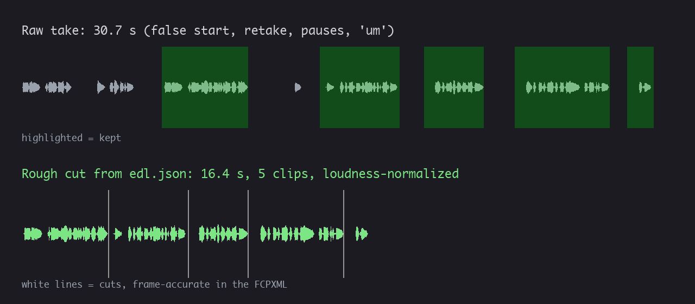
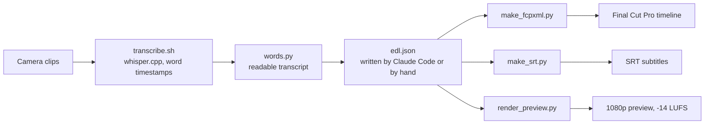

# fcpxml-roughcut

Rough-cut talking-head footage from the command line and finish it in Final Cut Pro. Whisper transcribes every word with its timestamp; an AI agent (or you) writes the cuts in a small `edl.json`; the scripts turn it into a frame-accurate FCPXML timeline, SRT subtitles and a loudness-normalized preview.



- **Frame-accurate**: every cut lands on an exact frame, with rational time maths (29.97 and 59.94 fps handled exactly) and the camera timecode preserved.
- **Checked against Apple's spec**: the generated FCPXML validates against the FCPXML 1.10 DTD shipped with Final Cut Pro.
- **Local**: transcription runs on the Mac with whisper.cpp. No footage is uploaded.
- **The editor stays in charge**: the output is a normal Final Cut Pro project, ready for B-roll, music and grading.

## The problem

Rough-cutting a talking-head video is the slowest and least creative part of editing: find the good take, remove the pauses, the "um"s and the false starts, one cut at a time. Once you have a word-level transcript, that part is mechanical. So I split the job. The machine does the rough cut from the transcript; I keep the creative work in Final Cut Pro.

## How it works



The AI part is the middle step. In my workflow, Claude Code reads the transcript, picks the takes and writes `edl.json`; I review the plan before the timeline is generated. Everything around it is deterministic: the scripts do the frame maths, so a model never has to count frames.

## Requirements

- macOS, since Final Cut Pro only runs there. The scripts themselves only need ffmpeg, whisper.cpp and Python.
- [Homebrew](https://brew.sh): `brew install ffmpeg whisper-cpp`
- Python 3.9 or later, standard library only
- A Whisper model, about 3 GB for large-v3:

```bash
mkdir -p ~/.cache/whisper-cpp
curl -L -o ~/.cache/whisper-cpp/ggml-large-v3.bin \
  https://huggingface.co/ggerganov/whisper.cpp/resolve/main/ggml-large-v3.bin
```

The model is chosen with environment variables: `WHISPER_MODEL` (default `ggml-large-v3.bin`) and `WHISPER_MODEL_DIR` (default `~/.cache/whisper-cpp`). For example, `WHISPER_MODEL=ggml-large-v3-turbo.bin` is faster and lighter.

```bash
git clone https://github.com/Bouliw/fcpxml-roughcut.git
cd fcpxml-roughcut
scripts/check_env.sh   # lists what is missing, installs nothing
```

## Try it on a generated clip

`examples/make_demo_clip.sh` builds a fake 30-second take: a synthetic voice (macOS `say`) over an ffmpeg test pattern, in 1080p at 29.97 fps with a 01:00:00:00 timecode. The voice makes a false start, starts again, pauses and hesitates, like a real first take. The cuts for this clip are already written in [`examples/edl.json`](examples/edl.json).

```bash
examples/make_demo_clip.sh
cd examples
../scripts/transcribe.sh demo/talking-head.mp4 demo/transcripts en
python3 ../scripts/words.py demo/transcripts/talking-head.json
python3 ../scripts/make_fcpxml.py edl.json -o demo/demo.fcpxml
python3 ../scripts/make_srt.py edl.json -o demo/demo.srt --transcripts demo/transcripts
python3 ../scripts/render_preview.py edl.json -o demo/preview.mp4
```

The transcript (`demo/transcripts/talking-head.txt`) is what the agent reads to write the cuts:

```
[00:00.05–00:03.00] Hi everyone, today we're going to...
[00:03.00–00:05.24] No, let me start again.
        (pause 1.4 s)
[00:06.68–00:10.54] Hi everyone, today I'll show you how to edit a video from the terminal.
        (pause 2.0 s)
[00:12.52–00:13.08] [Um.]
        (pause 1.0 s)
[00:14.12–00:17.68] First, Whisper transcribes every word with its timestamp.
        (pause 1.3 s)
[00:19.02–00:21.64] Then the cuts are written to a JSON file.
        (pause 1.6 s)
[00:23.28–00:27.56] And the script builds a Final Cut Pro timeline, accurate to the frame.
        (pause 1.0 s)
[00:28.58–00:29.62] Your turn.
[00:30.05–00:59.98] Thank you.
```

The last line is a Whisper hallucination on the final second of silence: nobody says "Thank you". That is why a person or an agent reads the transcript before cutting, and why `edl.json` simply leaves it out.

```
demo/demo.fcpxml
Total duration: 0:16 (16.38 s, 491 frames at 29.970 fps) | 5 clips | format 1920x1080
demo/demo.srt: 8 subtitles, 46 words
demo/preview.mp4: 16.40 s (expected 16.38 s, difference +0.02 s)
```

In Final Cut Pro: **File › Import › XML** for the timeline, then **File › Import › Captions** for the subtitles. The footage must stay where it was when the FCPXML was generated.

What I checked on this demo:

- `xmllint --dtdvalid` against `FCPXMLv1_10.dtd` from the Final Cut Pro bundle: valid.
- Integrated loudness of the preview: -14.4 LUFS for a -14 LUFS target.
- Whisper run again on the preview: every word comes back intact, so no cut eats a syllable.

## The edl.json format

```json
{
  "project": "Weekend vlog",
  "vertical": false,
  "clips": [
    {"file": "footage/C0007.MP4", "in": 83.12, "out": 91.40, "chapter": "Hook", "note": "strongest line"},
    {"file": "footage/C0001.MP4", "in": 0.42, "out": 12.95, "chapter": "Arrival"},
    {"file": "footage/C0001.MP4", "in": 14.10, "out": 31.77, "marker": "B-roll here"}
  ],
  "markers": [{"at": 45.0, "text": "punch-in zoom to hide the cut"}]
}
```

| Field | Required | Meaning |
|---|---|---|
| `clips` | yes | Cuts in timeline order. The same source can come back as often as needed. |
| `clips[].file` | yes | Source file: absolute, `~/...` or relative to `edl.json`. |
| `clips[].in`, `out` | yes | Seconds in the source, read from the transcript. The scripts snap them to frames. |
| `clips[].chapter` | no | Chapter marker at the start of the clip (YouTube chapters). |
| `clips[].marker` | no | Marker at the start of the clip. |
| `clips[].note` | no | Free text for whoever writes the cuts. Ignored by the scripts. |
| `markers` | no | `{"at": seconds, "text": ...}`: a marker at a timeline time. |
| `project` | no | Project name in Final Cut Pro (default "Rough cut"). |
| `vertical` | no | `true` for a 1080×1920 Short; clips are set to "fill". |
| `format` | no | Forces the project format, e.g. `{"width": 3840, "height": 2160, "fps": "60000/1001"}`. Default: the first clip. |

Cutting rules I use (and give to the agent):

- Cut between words, about 0.08 s before the first word and 0.12 s after the last. Less eats syllables; more makes jump cuts drag.
- Remove pauses longer than about 0.5 s, isolated hesitations and false starts. When a sentence is said twice, keep the last take.
- Open on the hook (the strongest 5 to 15 seconds), then go back to the chronological order.
- YouTube only shows chapters if the first starts at 0:00, there are at least 3, and each lasts 10 s or more. `make_fcpxml.py` checks this and prints the chapter list for the video description.

## Scripts

| Script | Role |
|---|---|
| `check_env.sh` | Checks ffmpeg, whisper.cpp, the model and hardware encoding. Installs nothing. |
| `probe.py` | Footage inventory: duration, resolution, exact frame rate, codec, audio tracks, timecode. |
| `transcribe.sh` | Extracts the audio and runs whisper.cpp with one segment per word. |
| `words.py` | Turns the Whisper JSON into timestamped words and a readable transcript with pauses and hesitations flagged. |
| `contact_sheet.sh` | One thumbnail every N seconds, 30 per sheet, to spot unusable shots and B-roll. |
| `timeline.py` | Shared core: probing, frame-rate snapping, timecode, rational time, frame-accurate timeline from `edl.json`. |
| `make_fcpxml.py` | Writes the FCPXML 1.10 timeline with markers and chapter markers. |
| `make_srt.py` | Re-times the transcript words onto the edited timeline and writes SRT subtitles. |
| `render_preview.py` | Renders a quick preview (hardware encoder when available) and normalizes loudness. |

## Design decisions

- **Rational time everywhere.** FCPXML counts time in fractions of a second: one frame at 29.97 fps is `1001/30000s`. Every calculation uses Python's `Fraction`, so hundreds of cuts add up without rounding drift, and a measured rate like 59.9401 is snapped to `60000/1001`.
- **Camera timecode preserved.** Timecode is read with ffprobe and converted to frames, drop-frame included, so clip times in Final Cut Pro match the source.
- **The cut list is data, not code.** `edl.json` is small enough for an LLM to write from a transcript and for a person to review in a minute. The model decides what to keep; it never computes a frame number.
- **Subtitles from the same word timestamps.** They follow the cuts without a second transcription.
- **Preview at -14 LUFS.** That is YouTube's loudness reference, so the preview sounds like the published video will.
- **Non-destructive.** The footage is never modified: Final Cut Pro links to the original files.

## Limitations

- The timeline is a single storyline (one video clip and its audio per cut): B-roll, music and titles are added in Final Cut Pro.
- Whisper word timestamps are approximate, often a few tenths of a second early after a pause. The margins protect syllables, but some cuts keep a little silence.
- Whisper may drop "um"s entirely (they show up as an unexplained pause) or invent text on silence, as in the demo.
- Paths in the FCPXML are absolute: generate it after the footage is in its final folder.

## How I built it

I designed the workflow under strict, targeted requirements: frame-accurate cuts, footage never modified, everything local, and an output I can finish by hand in Final Cut Pro. The division of labour is deliberate: the AI agent proposes the cuts from the transcript, I validate the plan, import the timeline and do the creative part.

## License

MIT, see [LICENSE](LICENSE).
