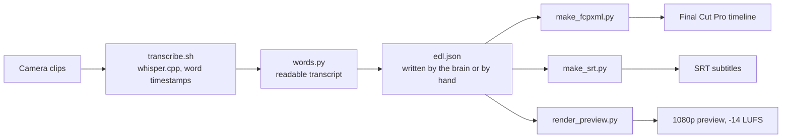

# fcpxml-roughcut

[](https://github.com/Bouliw/fcpxml-roughcut/actions/workflows/tests.yml)

[Version française](README.fr.md)

Rough-cut talking-head footage from the command line and finish it in Final Cut Pro. Whisper transcribes every word with its timestamp; an AI agent (or you) writes the cuts in a small `edl.json`; the scripts turn it into a frame-accurate FCPXML timeline, SRT subtitles and a loudness-normalized preview.


- **Frame-accurate**: every cut lands on an exact frame, with rational time maths (29.97 and 59.94 fps handled exactly) and the camera timecode preserved.
- **Checked against Apple's spec**: every FCPXML is validated against the DTD shipped inside the installed Final Cut Pro before it is used, and `--open` sends it straight to Final Cut Pro.
- **Local**: transcription runs on the Mac with whisper.cpp. No footage is uploaded.
- **The editor stays in charge**: the output is a normal Final Cut Pro project, ready for B-roll, music and grading.

## The app: Roughcut

<p align="center"></p>

Roughcut is the Mac app around these scripts: drop a folder of footage, press **Edit**, open the result in Final Cut Pro. Nothing else to install: no Terminal, no Homebrew.

<p align="center">
  
  
  
</p>

### Install

1. Download `Roughcut-<version>.dmg` from the [latest release](https://github.com/Bouliw/fcpxml-roughcut/releases/latest), open it and drag Roughcut into Applications.
2. Open Roughcut. It is not signed by an identified developer yet, so the first time macOS stops it: click **Done**.

   
3. Open **System Settings › Privacy & Security**, scroll down to **Security** and click **Open Anyway**, then confirm with your password. macOS remembers it: from then on, Roughcut opens like any other app.

   
4. The first launch takes three screens: who makes the editing choices (Claude Code, found and checked as signed in; LM Studio or Ollama, found running; or an API key, kept in the macOS keychain), the language you speak most in your videos (passages in another language are written as spoken) and your music folder (optional), and the downloads: the editing tools (52 MB) and the transcription model (large-v3-turbo, 1.6 GB, unless a Whisper model is already on the Mac).

The first time an edit reads footage from the Desktop, Documents or Downloads folder, macOS asks whether Roughcut may access it: allow it.

It needs a Mac with Apple silicon, macOS 14 or later, Final Cut Pro (the free trial works) and about 3 GB of free space. Roughcut has been tested on macOS 26.5. It is built for macOS 14: the build stops if the app or any of its tools needs a newer macOS or lacks Apple silicon code, and the compilers flag any newer macOS function used without a check; it has not been run on macOS 14 or 15 yet.

### Use

Drop the folder on the window (or on the Dock icon), pick the music, press **Edit**. The window shows the four steps (transcription, looking at the footage, choosing the cuts, building the project), a progress bar, the time left, estimated from the length of the footage and learned from each edit, and **Cancel**. The window can be closed: the menu bar icon follows the edit, and a notification says when it is ready. **Open in Final Cut Pro**, choose a library: one event holds the logged clips, the edit and the vertical Shorts (up to three, each from a different moment). Titles, description, chapters and tags are in `publication.txt` (**Show in Finder**).

Settings (⌘,): the brain, the music folder, the music level under the voice, zooms, how many Shorts (none to three). The rest is under Advanced: projects folder, transcription model, spoken language, the library to remind, the app's language, the download speed (a limit keeps the connection usable while the model downloads), and `roughcut.json` for everything else.

### Build it yourself

With the Command Line Tools alone (no Xcode):

```bash
app/runtime/build_runtime.sh   # the engine's tools, from pinned and checked sources (about 15 min)
app/build_app.sh               # build/Roughcut.app and build/Roughcut-<version>.dmg
```

An engine runtime is published once, with the release named in `app/runtime/versions.sh` (`RUNTIME_RELEASE`, `RUNTIME_SHA`): later versions of the app download it from there and check it.

Signing is ad hoc for now. With an Apple Developer ID, `SIGN_IDENTITY="Developer ID Application: …" app/runtime/build_runtime.sh` signs every binary of the tools, and `SIGN_IDENTITY=… NOTARY_PROFILE=… app/build_app.sh` signs the app with the hardened runtime, then notarizes and staples the disk image (`xcrun notarytool store-credentials` makes the profile): the Open Anyway step disappears.

### What it downloads, and the licenses

The app and the scripts are under the MIT license. The engine's tools, downloaded at the first launch, keep their own licenses, all of which allow distributing them next to MIT code. The archive's `licenses` folder holds every license text and the exact sources the tools were built from.

| Component | License | Use |
|---|---|---|
| ffmpeg and ffprobe 8.1 | LGPL 2.1 or later: built without any GPL or non-free part | separate programs, sources and build script published |
| FreeType, FriBidi, HarfBuzz, libass | FreeType License, LGPL 2.1+, MIT, ISC | inside ffmpeg, for the captions |
| whisper.cpp 1.9 | MIT | separate program |
| Whisper large-v3 and large-v3-turbo | MIT (OpenAI) | downloaded from Hugging Face |
| Python 3.12 ([python-build-standalone](https://github.com/astral-sh/python-build-standalone)) | PSF License, and those of the libraries built into it | runs the scripts |
| numpy, PyObjC, the Anthropic SDK and their dependencies | BSD, MIT, Apache 2.0, PSF | Python packages |

OpenCV is left out on purpose: its macOS wheels carry a GPL build of FFmpeg (x264, x265). The few image operations the analysis needed are written with numpy.

Full notices: [THIRD_PARTY_NOTICES.md](THIRD_PARTY_NOTICES.md), also inside the app (About Roughcut, and `THIRD_PARTY_NOTICES.txt` in its Resources).

### Updating

Download the new `Roughcut-<version>.dmg` from the [releases](https://github.com/Bouliw/fcpxml-roughcut/releases) and drag Roughcut into Applications again, replacing the old one. The settings, the projects, the tools and the transcription model are kept: nothing is downloaded again unless a release says the tools changed. With the ad hoc signature, macOS asks once more to confirm the opening (Open Anyway) and, if the footage is on the Desktop, to allow access to it. When a new version is out, a line at the top of the window and in the menu bar menu says so and leads to it: Roughcut looks at the list of releases on GitHub once a day.

### Where it keeps its files, and uninstalling

| What | Where |
|---|---|
| The app | `/Applications/Roughcut.app` |
| The tools and the transcription model (about 1.8 GB) | `~/Library/Application Support/Roughcut` |
| The settings of the app | `~/Library/Preferences/io.github.bouliw.roughcut.plist` |
| The projects, their settings (`roughcut.json`) and a cache of transcripts and measurements (`.cache`, a few MB per folder of footage) | `~/Movies/Roughcut` (or the projects folder chosen in Settings) |
| An API key, if one was saved | the keychain, item `fcpxml-roughcut` (Keychain Access) |
| A Whisper model shared with the scripts, if any | `~/.cache/whisper-cpp` |

To uninstall: quit Roughcut (menu bar icon › Quit), drag the app to the Trash, then in the Finder (Go › Go to Folder…) move `~/Library/Application Support/Roughcut` and `~/Library/Preferences/io.github.bouliw.roughcut.plist` to the Trash, and delete the `fcpxml-roughcut` item in Keychain Access if an API key was saved. The projects folder holds your edits: keep it, or delete it once they are no longer needed (Final Cut Pro reads the Shorts' captions from it). The `.cache` folder inside it can be deleted at any time; the next edit of the same footage just takes longer.

### Reporting a problem

When an edit stops, the window says why, in plain words. **Report the problem** (also in the menu bar menu and the Help menu) copies a report and opens a new GitHub issue with it: the versions of Roughcut, of its engine and of macOS, the message, the technical detail and the end of `montage.log`, with your home folder and your name taken out. Read it before sending: the log also holds the names of your folders and clips. **Show the log** opens `montage.log` itself.

### Footage

- **Final Cut Pro**, the paid version or the trial, 10.6 or later: the project is written in the newest FCPXML the installed Final Cut Pro imports (1.10 for 10.6, up to 1.13 for 11), read from the app itself. An older Final Cut Pro is said on the first screen.
- **HDR and 10-bit** (HLG, PQ): each clip declares its own colour space to Final Cut Pro, which converts it to the Rec. 709 timeline, the usual choice for YouTube. For an HDR video, set the library to Wide Gamut HDR and the project to Rec. 2020 HLG in Final Cut Pro. D-Log M footage looks flat until a LUT is applied: select the clips, then Inspector › Info › Camera LUT (DJI's LUT can be added there). The analysis judges HLG and PQ footage on the SDR picture Final Cut Pro shows on a Rec. 709 timeline (ITU-R BT.2100 and BT.2408: HDR reference white at SDR white, highlights rolled off), and counts as overexposed only what the camera itself clipped. D-Log M cannot be told from the file: with `"quality": {"log_footage": true}` in `roughcut.json`, every clip is converted with the D-Log curve DJI published, an approximation of D-Log M's.
- **External disks** work (exFAT included); macOS may ask once whether Roughcut can use removable volumes. Keep the disk connected: Final Cut Pro reads the footage from it.
- **iCloud Drive**: footage not downloaded yet is found before the edit starts, with the way to download it (right-click › Download Now).
- **Sleep**: the Mac is kept awake during an edit (not with the lid closed). In Low Power Mode, an edit simply takes longer.
- **Languages**: a clip mixing languages (narration in one, an interview in another) is transcribed with each passage in its own language, in the setting "Several, detect it" as with a main language given. Changing it later: Settings › Advanced.

### Accessibility

The window follows the light or dark appearance of the Mac and can be resized. Keyboard: Return starts the edit or opens the result, Esc cancels an edit, Cmd-O chooses a folder, Cmd-, opens the settings. VoiceOver reads the drop zone, each step with its state, the progress and the brain chosen.

## The problem

Rough-cutting a talking-head video is the slowest and least creative part of editing: find the good take, remove the pauses, the "um"s and the false starts, one cut at a time. Once you have a word-level transcript, that part is mechanical. The tool does the rough cut from the transcript; the creative work stays with the editor, in Final Cut Pro.

## How it works


```mermaid
flowchart LR
    A[Camera clips] --> B[transcribe.sh<br/>whisper.cpp, word timestamps]
    B --> C[words.py<br/>readable transcript]
    C --> D[edl.json<br/>written by the brain or by hand]
    D --> E[make_fcpxml.py]
    D --> F[make_srt.py]
    D --> G[render_preview.py]
    E --> H[Final Cut Pro timeline]
    F --> I[SRT subtitles]
    G --> J[1080p preview, -14 LUFS]
```

The AI part is the middle step. The brain (Claude Code, a local model or an API key) reads the transcript, picks the takes and writes `edl.json`; you can review it before the timeline is built. Everything around it is deterministic: the scripts do the frame maths, so a model never has to count frames.

## Requirements

- macOS, since Final Cut Pro only runs there. The scripts themselves only need ffmpeg, whisper.cpp and Python.
- [Homebrew](https://brew.sh): `brew install ffmpeg whisper-cpp`
- Python 3.9 or later, standard library only for the rough cut; `analyze.py` also needs numpy, and uses Apple Vision (`pyobjc-framework-Vision`) when it is there
- A Whisper model, 1.6 GB for large-v3-turbo:

```bash
mkdir -p ~/.cache/whisper-cpp
curl -L -o ~/.cache/whisper-cpp/ggml-large-v3-turbo.bin \
  https://huggingface.co/ggerganov/whisper.cpp/resolve/main/ggml-large-v3-turbo.bin
```

The model is chosen with environment variables: `WHISPER_MODEL` (default `ggml-large-v3-turbo.bin`) and `WHISPER_MODEL_DIR` (default `~/.cache/whisper-cpp`). turbo is the default: on French speech it agrees with large-v3 on 98 % of the words, closer to what is said (large-v3 adds the "ne" that speakers drop), three times faster. When turbo is not there but large-v3 is, the scripts use large-v3 and say so.

One Whisper pass keeps one language: given French, or detecting it from the first 30 s, an English answer comes out translated into French, or left out. So `transcribe.sh` (through `languages.py`) first asks Whisper the language of every 30 s; where it is not sure, it asks again piece by piece, the sound cut at its pauses. When several languages are spoken, each run is transcribed in its own, cut in the pause where the language changes (in the quietest moment when music leaves no pause), and a stretch of speech Whisper jumped over is transcribed again. A run under 15 s in another language than the runs around it is transcribed in both, and keeps the one Whisper writes it in with more confidence: on its own, a French sentence can be taken for English (on real footage, 0.89 against 0.71; an English answer, 0.83 against 0.48). The language given (`transcribe.sh clip out fr`) is the main one; `auto` takes the one spoken longest. On a test video of about 30 minutes alternating two languages, it found each change of language, got back an answer a single pass had left out, and none of the phrase a single pass repeated 20 times over another answer; the transcription took 119 s instead of 85 s. With one language, it is a single pass, as before, after about 35 s per hour of footage to check the language (M4 Max).

```bash
git clone https://github.com/Bouliw/fcpxml-roughcut.git
cd fcpxml-roughcut
scripts/check_env.sh   # lists what is missing, installs nothing
```

## Try it on a generated clip

`examples/make_demo_clip.sh` builds a fake 30-second take: a synthetic voice (macOS `say`) over an ffmpeg test pattern, in 1080p at 29.97 fps with a 01:00:00:00 timecode. The voice makes a false start, starts again, pauses and hesitates, like a real first take. The cuts for this clip are already written in [`examples/edl.json`](examples/edl.json).

```bash
examples/make_demo_clip.sh
cd examples
../scripts/transcribe.sh demo/talking-head.mp4 demo/transcripts en
python3 ../scripts/words.py demo/transcripts/talking-head.json
python3 ../scripts/make_fcpxml.py edl.json -o demo/demo.fcpxml --open
python3 ../scripts/make_srt.py edl.json -o demo/demo.srt --transcripts demo/transcripts
python3 ../scripts/render_preview.py edl.json -o demo/preview.mp4
```

The transcript (`demo/transcripts/talking-head.txt`) is what the agent reads to write the cuts:

```
[00:00.05–00:03.00] Hi everyone, today we're going to...
[00:03.00–00:05.24] No, let me start again.
        (pause 1.4 s)
[00:06.68–00:10.54] Hi everyone, today I'll show you how to edit a video from the terminal.
        (pause 2.0 s)
[00:12.52–00:13.08] [Um.]
        (pause 1.0 s)
[00:14.12–00:17.68] First, Whisper transcribes every word with its timestamp.
        (pause 1.3 s)
[00:19.02–00:21.64] Then the cuts are written to a JSON file.
        (pause 1.6 s)
[00:23.28–00:27.56] And the script builds a Final Cut Pro timeline, accurate to the frame.
        (pause 1.0 s)
[00:28.58–00:29.62] Your turn.
[00:30.05–00:59.98] {Thank} {you.}
```

The last line is a Whisper hallucination on the final second of silence: nobody says "Thank you". `words.py` puts in braces every word that lasts more than 3 seconds, the usual sign of text invented on silence; the person or agent who reads the transcript leaves it out of `edl.json`. Two more Whisper habits are flagged. Several words sharing one timestamp get a `≈` before the first one: after a long pause it is real speech whose timing is lost, so leave a wider margin there. When such a run of five words or more repeats what was just said, it is text Whisper wrote twice, and it goes in braces too. Words in braces never reach the subtitles.

```
demo/demo.fcpxml
Total duration: 0:16 (16.32 s, 489 frames at 29.970 fps) | 5 clips | format 1920x1080
DTD check: valid against the FCPXML 1.13 DTD of Final Cut Pro
Opened in Final Cut Pro: the import starts there.
demo/demo.srt: 8 subtitles, 46 words
demo/preview.mp4: 16.32 s (expected 16.32 s, difference +0.00 s)
```

`--open` hands the file to Final Cut Pro, or to Final Cut Pro Trial when that is the one installed (`FCP_APP` picks another app). Final Cut Pro then asks which library to import into: that is the only click. Without `--open`: **File › Import › XML**. Subtitles: **File › Import › Captions**. The footage must stay where it was when the FCPXML was generated.

The FCPXML is version 1.13 (Final Cut Pro 11 and later). `--fcpxml-version 1.10` writes the same timeline for Final Cut Pro 10.6 and later. After each file is written, `make_fcpxml.py` validates it with `xmllint` against the DTD of that version found inside the Final Cut Pro app, and stops if it fails. The same check works on any FCPXML, including one exported from Final Cut Pro (`.fcpxmld` bundles too): `scripts/fcp.py check file.fcpxml`.

Checked on this demo:

- Validation against `FCPXMLv1_13.dtd` from the Final Cut Pro 11.2 bundle, and against 1.10 to 1.12 with `--fcpxml-version`: valid.
- `--open` with Final Cut Pro Trial 11.2: the import starts.
- Integrated loudness of the preview: -13.8 LUFS for a -14 LUFS target (-14.1 LUFS on a real 58-second Short).
- Whisper run again on the preview: every word comes back intact, so no cut eats a syllable.

## One click from the Finder

`install_quick_action.py` adds a Quick Action to the Finder: right click on a folder of footage > Quick Actions > Edit this footage. It runs `auto_edit.py` on that folder in the background: transcription, image analysis, the editing choices, dialogue levels, zooms, J and L cuts, B-roll, music, vertical Shorts with animated captions and the logged clips, all in **one FCPXML with one event**, named after the folder, the date and the time, so Final Cut Pro asks for a library once and never asks to keep both. A notification says when it is ready, and the file opens in Final Cut Pro. The only question is which music, at the start, so the rest runs unattended (the folder of tracks is asked once; without an answer within 10 minutes, the first choice is taken).

```bash
python3 scripts/install_quick_action.py --name "Edit this footage" --app /Applications/Roughcut.app
```

With `--app`, the Quick Action runs the engine of the Roughcut app installed: its tools, its transcription model and language, its projects folder, so the Finder and the app always edit alike, and updating the app updates both. The same launcher runs any script by hand: `bash /Applications/Roughcut.app/Contents/Resources/engine/roughcut make_fcpxml.py edl.json -o project.fcpxml` (`--version` says which). Without `--app`, the Quick Action runs the scripts of this folder with the Python given (`--python`, `--work-dir`).

The cuts go inside what is kept, not only between sentences. Whisper's word timestamps run on through silences, so `words.py --audio clip` fits the words to the pauses heard in the sound (`pauses.py`); a sentence longer than 12 s is then cut where the speaker breathes, so the brain can keep part of a long stretch; and the blanks, hesitations and words said again at once ("we went, we went to the lake") are cut out of every passage kept. The brain is told how much was said and to aim at about half of it: it drops what repeats an idea, comments on what the camera shows, small talk and dead ends, but keeps the jokes, the question that leads to an answer it keeps, and ends the edit on a line that closes it. On a test video of about 30 minutes, the edit went from 18-20 minutes to 14-15. Once the edit is put together, it is read again as a viewer would (`review.py`): the brain gets what the edit says, line by line, next to what was cut, and fixes what does not follow (a reference to a passage that was cut, a new place with nothing to show the way there, a question without its answer or an answer without its question) by putting back a line or a shot, or taking a line out. It adds a tenth of the edit at most, takes out as much at most, never reorders it, and its additions carry a marker in Final Cut Pro; a new version made with `--decisions` asks the brain nothing and re-uses the review saved with the choices. The Shorts are the strongest passages of the video, each one subject told by one person, up to three (`auto.short`), at most one per 2.5 minutes of speech so a short video is not cut up whole, each from a moment of its own and in its own project with its own captions. One that takes from the opening (the introduction) is replaced by a Short built around the hook, or from the densest minute no other Short holds. Without a music folder, the folder is asked for; when the question cannot be shown, the notification says the edit has no music, and why.

A clip without sound is taken as B-roll and not transcribed, and any folder name works (accents, emojis, quotes). When something goes wrong, the notification says in plain words at which step, and the details go to `montage.log`. An edit stopped or cut short can simply be started again: what was already transcribed and measured is kept, and two edits of the same footage at once share it safely.

Every setting lives in `roughcut.json` in the work folder. A new version (shorter, another hook, a passage removed) starts from the `brain-answer.json` of a version, edited: `auto_edit.py footage --decisions edited.json`. Transcripts and analysis are kept, so it takes about a minute.

## The brain

Only the judgement calls go to a language model: which takes to keep, the hook and the chapters, where the B-roll goes, the Shorts' extracts, titles, description and tags. Transcription, image analysis, sound and the FCPXML work the same whatever the brain. It is chosen once, at the first launch (one question, three options), and changed later in `roughcut.json` (`brain.engine`):

| Brain | Quality | Cost | Privacy |
|---|---|---|---|
| `claude`: Claude Code (`claude -p`) | The best | Included in a Claude subscription | Transcripts go to Anthropic |
| `local`: any OpenAI-compatible server (LM Studio, Ollama) | Good with a 30B-class model | Free | Nothing leaves the Mac |
| `api`: an Anthropic or OpenAI key | Very good | Paid per use | Transcripts go to the provider |

API keys go to the macOS keychain (`python3 scripts/brain.py set-key anthropic`), never to a file. When Claude does not answer (usage limit reached), the local brain takes over if one is set (`brain.local_model`) and the notification says so; when nothing answers, all the speech is kept in order. On a 36 GB Mac, Qwen 3.6 35B-A3B (MLX 4-bit, 20 GB) makes a good local brain: only 3B of its parameters work on each word, so it stays fast.

What the brain receives, whichever it is: a text with the transcripts (each sentence with its times), the names of the clips, the stretches found unusable and why, and the B-roll shots found, with the labels Apple Vision gave them ("outdoor, people"). No picture, no sound, no video, and no file path. With `claude` and `api` that text goes to Anthropic (or OpenAI) under their terms; with `local` it stays on the Mac. `brain-prompt.txt`, in each project folder, is exactly what was sent. Apart from the brain, the app contacts GitHub (to download its tools once, and once a day to see whether a new version is out) and Hugging Face (the transcription model, once); it sends nothing about you or your footage, and there is no analytics.

## The edl.json format

```json
{
  "project": "Weekend vlog",
  "vertical": false,
  "clips": [
    {"file": "footage/C0007.MP4", "in": 83.12, "out": 91.40, "chapter": "Hook", "note": "strongest line"},
    {"file": "footage/C0001.MP4", "in": 0.42, "out": 12.95, "chapter": "Arrival"},
    {"file": "footage/C0001.MP4", "in": 14.10, "out": 31.77, "marker": "B-roll here"}
  ],
  "markers": [{"at": 45.0, "text": "punch-in zoom to hide the cut"}]
}
```

| Field | Required | Meaning |
|---|---|---|
| `clips` | yes | Cuts in timeline order. The same source can come back as often as needed. |
| `clips[].file` | yes | Source file: absolute, `~/...` or relative to `edl.json`. |
| `clips[].in`, `out` | yes | Seconds in the source, read from the transcript. The scripts snap them to frames. |
| `clips[].chapter` | no | Chapter marker at the start of the clip (YouTube chapters). |
| `clips[].marker` | no | Marker at the start of the clip. |
| `broll` | no | B-roll to lay over the edit: `{"file", "in", "out", "at_source" or "at", "note"}` (see B-roll below). |
| `music` | no | Track under the edit: `{"file", "in", "at", "duck", "snap_broll"}` (see Music below). |
| `clips[].role` | no | Audio role in Final Cut Pro: `dialogue` (default), `music` or `effects`. |
| `clips[].split`, `split_seconds` | no | Split edit at the start of this cut: `j`, `l` or `none`, and its length (with `--split-edits`). |
| `clips[].note` | no | Free text for whoever writes the cuts. Ignored by the scripts. |
| `markers` | no | `{"at": seconds, "text": ...}`: a marker at a timeline time. |
| `project` | no | Project name in Final Cut Pro (default "Rough cut"). |
| `vertical` | no | `true` for a 1080×1920 Short; clips are fitted, then scaled up to fill the frame (imported with a "fill" conform, Final Cut Pro left them small in the middle). |
| `format` | no | Forces the project format, e.g. `{"width": 3840, "height": 2160, "fps": "60000/1001"}`. Default: the first clip. |

The agent does not have to work out the margins itself. It can list the sentences to keep, as time ranges read in the transcript, and let `edl_from_ranges.py` write the cuts: it keeps only the words inside each range, splits the range at every pause and hesitation, leaves out words in braces, and gives each cut a margin that stops halfway to the next word said. `pause`, `pre` and `post` can be changed for the whole list or for one range.

```json
{"project": "Weekend vlog", "file": "footage/C0001.MP4",
 "ranges": [{"from": 83.1, "to": 91.4, "chapter": "Hook"},
            {"from": 3.0, "to": 12.9, "post": 0.03, "note": "an um right after the last word"}]}
```

```bash
python3 scripts/edl_from_ranges.py ranges.json -o edl.json
```

Recommended cut rules, for a person or an agent writing `edl.json`:

- Cut between words, about 0.08 s before the first word and 0.12 s after the last. Less eats syllables; more makes jump cuts drag.
- Remove pauses longer than about 0.5 s, isolated hesitations and false starts. When a sentence is said twice, keep the last take.
- Open on the hook (the strongest 5 to 15 seconds), then go back to the chronological order.
- YouTube only shows chapters if the first starts at 0:00, there are at least 3, and each lasts 10 s or more. `make_fcpxml.py` checks this and prints the chapter list for the video description.

## Dialogue levels

`--level-audio` (on `make_fcpxml.py` and `render_preview.py`) measures the loudness of every cut with ffmpeg's EBU R128 meter and writes a gain per cut in the FCPXML (`adjust-volume`), towards one dialogue level. Nothing is rendered: the gains are ordinary volume settings you can change in Final Cut Pro.

Cuts from the same source share one gain, worked out from all of them, so back-to-back cuts of one take never jump in level. A cut gets its own gain only when it stands out from its source by more than 2 LU (someone further from the microphone, a shout): measuring 5 to 20 seconds of speech is only accurate to about 1 LU. Cuts shorter than a second take their source's gain. On a real edit alternating a presenter and several interviews, the level spread between cuts went from 4.8 LU to 1.8 LU.

Moments played for their own sound (the IRL moments of a vlog, role `effects`) go towards -25 LUFS, under the voice: on real footage they ranged from -54 LUFS (a quiet room) to -14 (wind on a road, louder than the voice). A quiet one is raised by 6 dB at most, not to turn its hiss up. `--fades` adds a fade of a frame or two to the sound of every cut, so no cut clicks or jumps in room tone, and a quarter of a second to the moments played for their sound, which come in and go out softly under the hard cut of the picture. Gains and fades are ordinary volume settings and fade handles in Final Cut Pro.

Where the background is loud, Final Cut Pro's own Voice Isolation is set on the speech (`audio.voice_isolation`, auto by default): on a clip whose voice stands less than 25 dB above the background, measured between the words (walking, among people: 18 to 24 dB on real footage; an interview somewhere quiet: 40 to 46), at a moderate 40 %, never full. It goes in the FCPXML as `adjust-voiceIsolation`, which Final Cut Pro applies on import (checked in a library: Apple's sound isolation effect on the clip), and can be turned off there clip by clip.

```
Dialogue levels (target -16 LUFS; a cut gets its own gain beyond 2 LU from its source):
  1  0:00  cut  -17.1  source  -19.4  gain +1.1dB
  2  0:16  cut  -19.7  source  -19.4  gain +3.4dB
  4  0:55  cut  -23.2  source  -19.4  gain +7.2dB
```

## Looking at the footage

`analyze.py` samples three frames per second (with the next frame of each, to see the camera move) and measures:

- **sharpness**: the detail of the sharpest part of the picture (Laplacian variance over a 4×4 grid), so a sharp face over a soft background is not a blurred shot;
- **shake**: abrupt changes of the camera speed between samples (phase correlation), so a steady pan is not shake;
- **exposure**: black frames, underexposed frames, share of clipped highlights;
- with Apple Vision on macOS: **faces** and their capture quality, Apple's **aesthetic score**, and **scene labels**, used to guess a camera pointing at the ground (feet in the picture, or a road with nothing standing up).

For each clip it writes the ranges to reject with their reason, the best B-roll moments (no speech, sharp, steady, the best looking first) and thumbnail candidates saved as full-size JPEG. The measurements are cached: a second run, or a run with other thresholds, reads them back. Everything is a proposal from sampled frames, to be checked in the viewer.

```bash
pip install numpy pyobjc-framework-Vision   # Vision is optional and macOS only
python3 scripts/analyze.py footage/*.MP4 -o analysis --transcripts transcripts
```

On a 4K HEVC test video of about 30 minutes, the analysis took 8 minutes on an M4 Max, most of it decoding.

## Logging into a Final Cut Pro event

`organize.py` turns the analysis and the transcripts into an event to browse in Final Cut Pro: keyword ranges **Face cam** (speech over a detected face) and **B-roll** (no speech), a **Place** keyword from the GPS tag when the clip has one, rejected ranges with their reason (hide them with the browser's filter), favourite ranges on the best B-roll moments, and markers on the thumbnail candidates.

```bash
python3 scripts/organize.py footage/*.MP4 -o logged.fcpxml --analysis analysis --transcripts transcripts --open
```

## Punch-in zooms on jump cuts

`--zoom-jump-cuts` (on `make_fcpxml.py` and `render_preview.py`) scales up every other cut along a run of back-to-back cuts from the same source, 112 % by default, so a jump cut reads as a change of shot. The zoom is anchored on the face found by `analyze.py`: the frame moves by -(s-1) times the face position, so the face stays where it was and no border ever shows. A new source starts again at 100 %; cuts shorter than a second, cuts without a face (scenery: a centred zoom there only looks like a mistake) and vertical Shorts are left alone, and the script says so.

## J and L cuts where the scene changes

`--split-edits` (on `make_fcpxml.py` and `render_preview.py`) turns every cut where the source changes into a split edit: a J cut lets the next scene's sound start before its picture, an L cut lets the previous sound run over the next picture (`audioStart` and `audioDuration` in the FCPXML; in the primary storyline one sound gives up what the other gains). The length, 0.6 s by default, is cut down, or the cut left straight, so that no word of the transcripts is cut off or brought in: the sound moved across the cut must be free of speech on both sides. "auto" tries a J cut first, then an L cut; a cut can ask for `"split": "j"`, `"l"` or `"none"` and `"split_seconds"` in `edl.json`. The preview cuts picture and sound where Final Cut Pro will.

## B-roll

`broll.py` lists the shots to cut away to: every stretch of a clip where nobody speaks, nobody faces the camera most of the time (an interview whose speech the transcript missed) and nothing was rejected, with the scene labels Vision saw, the aesthetic score and a picture of its best moment. Whoever edits looks at the pictures, fills in a description and tags in `broll.json`, and matches the shots with what the transcript says. The chosen ones go in `edl.json`:

```json
"broll": [{"file": "footage/C0012.MP4", "in": 3.0, "out": 7.5, "at_source": 245.3, "note": "the lake"}]
```

`at_source` is a time in the talking-head clip, read in its transcript: the scripts find where it landed in the edit (`at` gives a timeline time instead). Each shot becomes a connected clip above the talking head, its sound turned down to -96 dB with the Effects role (it can be brought back), with a marker "B-roll: …" so every placement gets checked. Shots that overlap go one lane up; captions sit above them. The preview shows the B-roll over the picture while the talking head is still heard.

## Music

`music.py` gives the tempo and beats of each track (librosa, or the one of fcp-mcp-server through `uvx` when librosa is not installed; cached) and ranks the tracks of a folder for an edit: long enough first, then the closest to its length, then a tempo in the range asked for. The editor picks.

```bash
python3 scripts/music.py ~/Music/royalty-free --duration 480 --bpm 80-130
```

In `edl.json`, `"music": {"file": "music/track.mp3", "in": 30, "at": 0, "snap_broll": true}` lays the track under the edit as a connected audio clip with the Music role. Its volume dips under every stretch of speech taken from the transcripts (volume keyframes from -14 dB down to -28 dB: the dip ends as the speech starts, the rise follows its end, a gap shorter than `min_gap_seconds` stays down, and a gap too short for both ramps comes up only part of the way); with `snap_broll`, each B-roll starts and ends on the nearest beat within 0.35 s. The preview mixes the music the same way before normalising the loudness.

## Shorts: framing that follows the face, animated captions

On a vertical Short cut from horizontal footage, only a slice of the picture shows. `--follow-face` (on `make_fcpxml.py` and `render_preview.py`) moves that slice with the face found by `analyze.py`, or with the main subject when nobody faces the camera (the largest object Vision's saliency finds, when it is not the whole picture): position keyframes, a median over five samples against stray detections, a dead zone so the frame holds still while the face moves a little, a hold keyframe before each move so it never drifts, and never past the edge of the picture. A cut follows a face when one big enough is there at least half of the time, else the main subject; with neither, it stays centred.

`captions.py` writes word-by-word captions the Shorts way (three words on screen, the word being said highlighted and slightly bigger) as an `.ass` file, and renders it with libass into a transparent video as long as the timeline: HEVC with alpha, the Mac's own encoder, 40 times smaller than ProRes 4444 for the same picture (ProRes where it is missing). `--overlay captions.mov` lays it over the whole timeline as a connected clip with the Titles role, and over the preview too. Font, colours, size and position are settings (`captions.*`); on a vertical Short the captions sit above the app's buttons.

```bash
python3 scripts/captions.py edl.json -o captions.mov
python3 scripts/make_fcpxml.py edl.json -o short.fcpxml --follow-face --overlay captions.mov --open
```

## Dressing and subtitles

One setting, `auto.dressing` (Dressing in the app), dresses the main edit with what Final Cut Pro makes itself, so all of it stays editable there:

| Dressing | What the edit gets |
|---|---|
| None | Nothing. |
| Light (default) | A title where each chapter starts, and a cross dissolve into it. |
| Full | Also the time of day, a lower third for each person interviewed, and animated captions on the edit. |

- **Titles** use Final Cut Pro's own Basic Title with its look; only the text (the chapter) is set. A chapter starts on the IRL moments that lead into it (the way to the place), and when the story has chapters, its first part gets one ("Introduction" if the brain gave it no name).
- **The time of day** ("10h15", "10:15 AM") shows at the start of the story, at a chapter filmed 10 minutes or more after the last time shown, and wherever the clock jumps by half an hour. It is read from the date an iPhone writes with its time zone, else from a name like `DJI_20260115101520_0001`; a camera that only writes UTC shows none.
- **Lower thirds** use Basic Lower Third, placed where each person interviewed first answers (the brain marks it), with "Name" and "Country" to type: a name heard is too often misspelled to be written for you.
- **Dissolves** (half a second, picture and sound) are only put where both clips have the media they need around the cut; the others stay cuts, and the check before the import refuses a transition without media. The J and L cuts and the short audio fades step aside there.
- **Animated captions on the edit** are rendered as a strip of the frame (two lines high) in parts side by side, placed low in the frame: six times fewer pixels than the whole 4K frame, whose rendering the Mac's encoder limits (22 minutes of 4K: under 5 minutes and 150 MB, against 23 minutes and 30 GB in ProRes). Font, size, colours and height are set apart for the edit (`captions_main`) and the Shorts (`captions`).

Whatever the dressing, `subtitles.py` writes the subtitles of every video (the edit and each Short) for YouTube: `subtitles.<language>.srt` in the language of the footage and in English (`subtitles.languages`), each covering all that is said, a passage in another language translated by the brain (an English answer in the French file, a French question in the English one, a third language in both). The language of each line is guessed from its words, the brain corrects it. It also fixes the obvious slips of the transcription (capitals, apostrophes, spaces: "paris", "il ya"), and lists the words to check by ear in `to-check.txt` and as to-do markers in Final Cut Pro: a proper noun whose spelling is not sure, a word that does not fit ("the whether was nice": "weather"). A word is never changed without a person.

`captions.txt`, in each video folder, holds the text of the captions: fix a word there, then **Regenerate the captions** (in the menu bar, or once the edit is done; `subtitles.py project --regenerate`). The correction is kept with the transcript (`corrections.json`), so every video of the footage and every later version gets it; the animated captions are rendered again in place, only the parts that changed, and the subtitles written again, only the lines that changed asked to the brain.

```bash
python3 scripts/subtitles.py "project folder"                 # SRT files, to-check.txt, captions.txt
python3 scripts/subtitles.py "project folder" --regenerate    # after a fix in captions.txt
python3 scripts/make_fcpxml.py edl.json -o edit.fcpxml --dressing full --overlay captions.json
```

## Hesitations, cuts on silences, and the edit listened to

Whisper leaves hesitations out: on 47 minutes of real footage, it wrote 8 in 5,658 words. Two ways work together (`cuts.hesitations`, Settings › Advanced):
- Whisper is started on a text full of hesitations ("euh… donc, euh, voilà" in French, "um, uh, so" in English), so it writes them; it also punctuates better and writes speech it used to skip (437 more words on the same footage). Where it repeats that text over a silence, those words are flagged as invented.
- `hesitations.py` reads the sound itself every 10 ms (level, hiss above 2 kHz, voice and pitch) and finds the vowels held on one note between two words: a hesitation Whisper wrote takes the place where it is heard, and one it left out is added. A vowel inside a word, or at the start of one, is part of that word; only the stretched end of a word ("et… euh") counts.

On the same footage: 124 hesitations found (109 written by Whisper and heard, 15 heard only). Only 9 have a true silence on both sides; most touch the words, and there is no silence to cut them in. So each cut is checked, and a hesitation that fails stays in (`cuts.hesitations`: `none`, `clean` for only the ones with silences, `all`, the default, for every one that passes):
- one that would leave a word or two alone between two cuts stays: it would break the sentence;
- one touching the words is cut in the quietest moment next to it, only when the join sounds like two words said one after the other: the level and the sound just before and just after no further apart than 9 in 10 of the joins between two words said (13.6 dB and a spectral distance of 1.25, measured on 2,425 of them on real footage);
- once the edit is assembled, the words on either side of such a join must be heard whole; else the hesitation goes back.

Every cut edge is then put in a true silence heard in the sound, next to the word it starts or ends on, never on a hesitation beside it: Whisper's times are only a guide (a word often starts a little before them). Where no silence is heard (music, noise), the quietest moment there.

Once assembled, each video is listened to (`verify_edit.py`, `cuts.verify`): its sound, as Final Cut Pro plays it, is transcribed again and set against what was to be kept. A hesitation still heard is cut where the clip's own sound holds a vowel clear of every word, on the same terms as above (in silences, or a join that passes the checks); a word to keep cut at the edge of a cut gets that edge moved to the silence past it; a scrap of a word cut out, heard at an edge, is trimmed. Then again (`cuts.verify_rounds`, 3 at most), a fix never tried twice, and back to the better cuts if a round made it worse. A join that fails at the last listening still goes back, and the edit is listened to once more, only to time its words. The words are then timed on the sound of the edit itself (`final-words.json`): the animated captions and the SRT files follow it, not the times read in the clips. `to-listen.txt` lists what was checked, and where: hesitations cut (in silences, or touching the words with their joins checked), hesitations left in, fixes.

## Editing by the text

Once an edit is done, **Edit by the text** (in the window, or the menu bar for an older edit) shows the transcript of all the footage: the words of the edit in black, the passages cut in grey. A click on a word takes it out (struck through) or puts a grey word back; a click on the time of a line does the whole line. **Update in Final Cut Pro** makes a new version of the edit from the words chosen (`text_edit.py`, then `auto_edit.py --decisions`): the cuts on silences, the listening, the captions and the subtitles are made again, and the brain is asked nothing. What was changed by hand in Final Cut Pro is not carried over: editing by the text comes before the finishing there, as the window says.

```bash
python3 scripts/text_edit.py export "project folder"               # text.json: every word, and where it is
python3 scripts/text_edit.py apply "project folder" edits.json     # text-decisions.json, for auto_edit.py --decisions
```

## Scripted videos

For a video read from a script, `script_align.py` lines up the script (a text file, paragraphs separated by a blank line) with the transcripts of the takes. Every take of a paragraph is found through the three-word sequences it shares with the script, so Whisper's mistakes and small rewordings do not break the match ("dix heures" in the script, "10h" in the transcript); a take that goes back to the start of the paragraph is a retake. The best take of each paragraph is kept: the most complete, then the smoothest (hesitations, long pauses, repeated words), then the latest. It writes `ranges.json` for `edl_from_ranges.py`, a report with every take and the sentences never said in any take, and `visuals.txt`, every passage with a line for the pictures to find.

```bash
python3 scripts/script_align.py script.txt footage/*.MP4 -o project
python3 scripts/edl_from_ranges.py project/ranges.json -o project/edl.json
```

## Settings

Thresholds and targets live in [`config/defaults.json`](config/defaults.json). A `roughcut.json` in the project folder, or in any folder above it, overrides them (the closest wins), and `--config file.json` comes last. Unknown keys are refused, so a typo never goes unnoticed.

In the app, the Settings keep to what everyone may want (the brain, the music, the style, the dressing, a clearer voice, the look of the captions with five ready styles, Classic, Yellow pop, Minimal, Big impact and Karaoke, and the user's own saved ones). Everything else is in **Advanced**, each setting with a few words and its default value, and one button to restore them all; the tab is drawn from [`config/advanced.json`](config/advanced.json), so a setting added to the engine shows there with its explanation.

| Setting | Default | Meaning |
|---|---|---|
| `audio.dialogue_target_lufs` | -16 | Dialogue level the gains aim for. |
| `audio.max_gain_db` | 12 | Largest gain up or down. |
| `audio.clip_deviation_lu` | 2 | How far a cut must stand out from its source to get its own gain. |
| `audio.min_measure_seconds` | 1.0 | Shorter cuts are not measured. |
| `cuts.quiet_ratio` | 0.35 | Pause threshold, between the noise floor (0) and the speech level (1) of the clip. |
| `cuts.min_quiet_seconds` | 0.2 | Shortest pause heard. |
| `cuts.pause_seconds` | 0.5 | Longer pauses are cut out of the passages kept. |
| `cuts.max_sentence_seconds` | 12 | Longer sentences are cut where the speaker breathes, for the brain to choose from. |
| `cuts.remove_repeats` | true | Cut out words said again at once. |
| `roles.default_audio` | dialogue | Role of cuts without `role` in `edl.json`. |
| `zoom.scale` | 1.12 | Punch-in scale on jump cuts. |
| `reframe.*` | | Smallest face and share of the cut, dead zone, move duration of `--follow-face`. |
| `broll.*` | | Shortest shot, margin around speech, largest share of a face to camera, volume of the B-roll sound. |
| `split_edits.*` | | Mode (auto, j, l, none), length, shortest split worth making. |
| `music.*` | | Music level, level under speech, ramp down and ramp up, shortest gap that brings it back up, beat snapping window. |
| `brain.*` | | Engine (claude, local, api), fallback engine, local server and model, API provider and model. |
| `auto.*` | | Transcription language, library to pick in Final Cut Pro, music folder, whether to ask for the music, zooms on jump cuts, how many Shorts at most (3; `true` is 3, `false` none), the opening a Short never takes from (30 s), opening in Final Cut Pro. |
| `ui.language` | en | Language of the notifications and questions (en, fr). |
| `captions.*`, `captions_main.*` | | Shorts and main edit: font, size, colours, outline, pop, uppercase, words on screen, karaoke (the words said stay coloured), bottom margin. |
| `cuts.hesitations` | all | Hesitations cut: none, clean (a silence on both sides), all (also the ones touching the words, when their join passes the checks). |
| `cuts.splice_level_db`, `cuts.splice_timbre` | 13.6, 1.25 | A join where a hesitation touching the words was cut: largest jump of level and of sound. |
| `cuts.verify`, `cuts.verify_rounds` | true, 3 | Listen to each video once assembled, and fix what is heard wrong. |
| `cuts.silence_reach_seconds`, `cuts.silence_room_seconds` | 0.35, 0.04 | How far a cut edge may move to a true silence, and the silence kept next to the words. |
| `cuts.min_cut_seconds`, `cuts.min_piece_seconds` | 0.6, 0.4 | Shortest cut; a hesitation stays when cutting it leaves a shorter piece. |
| `audio.voice_isolation` | auto | Final Cut Pro's Voice Isolation on the speech: auto (where the background is loud), off, always. |
| `audio.voice_isolation_amount`, `audio.voice_isolation_below_db` | 40, 25 | Its amount, and how little the voice stands above the background for "auto" to set it. |
| `zoom.min_cut_seconds` | 1.0 | Shorter cuts are not zoomed. |
| `quality.*` | | Sampling rate, blur, shake and exposure thresholds, ground labels, B-roll and thumbnail counts, `log_footage` (D-Log M footage, converted with an approximate curve): see `config/defaults.json`. |
| `organize.*` | | Keyword names, smallest face for "Face cam", shortest range, event name. |

## Scripts

| Script | Role |
|---|---|
| `check_env.sh` | Checks ffmpeg, whisper.cpp, the model, hardware encoding and Final Cut Pro. Installs nothing. |
| `auto_edit.py` | From a folder of footage to one FCPXML (edit, Shorts, logged clips), without a conversation. |
| `install_quick_action.py` | Installs the Finder Quick Action that runs `auto_edit.py` on a folder. |
| `brain.py` | The judgement calls: Claude Code, a local server or an API key; the first-launch choice; keys in the keychain. |
| `fcpxml_merge.py` | Merges FCPXML files into one event, for a single import. |
| `probe.py` | Footage inventory: duration, resolution, exact frame rate, codec, audio tracks, timecode. |
| `transcribe.sh` | Extracts the audio and runs whisper.cpp with one segment per word, each language in its own (`languages.py`). |
| `words.py` | Turns the Whisper JSON into timestamped words and a readable transcript with pauses, hesitations, words said again and suspect words flagged; `--audio` fits the words to the pauses heard. |
| `pauses.py` | Finds the pauses in the sound of a clip (level under a threshold between noise floor and speech). |
| `contact_sheet.sh` | One thumbnail every N seconds, 30 per sheet, to spot unusable shots and B-roll. |
| `edl_from_ranges.py` | Turns the sentences to keep (time ranges) into the cuts of `edl.json`, with pauses, hesitations and words said again removed and safe margins. |
| `loudness.py` | Measures the dialogue of every cut and works out the gains of `--level-audio`. |
| `script_align.py` | Lines up a script with the takes, keeps the best take of each paragraph, lists the sentences never said. |
| `settings.py` | Reads `config/defaults.json` and the `roughcut.json` files that override it. |
| `analyze.py` | Samples the footage: sharpness, shake, exposure, faces, aesthetic score; rejects, B-roll moments, thumbnails. |
| `organize.py` | Logs the footage into a Final Cut Pro event: keyword ranges, ratings, markers. |
| `broll.py` | Catalogue of the B-roll shots to describe and place; works out the placements of `edl.json` "broll". |
| `music.py` | Tempo and beats of the tracks, ranked for an edit; the ducking and the beat grid of `"music"` in `edl.json`. |
| `reframe.py` | Works out the position keyframes of `--follow-face`. |
| `captions.py` | Word-by-word animated captions, rendered as a transparent video (HEVC with alpha); a strip of the frame, in parts, for a long edit. |
| `subtitles.py` | SRT subtitles of every video in two languages (the brain translates), slips fixed, words to check, `captions.txt` and its corrections. |
| `dressing.py` | The dressing of the main edit: chapter titles, time of day, lower thirds, dissolves, from Final Cut Pro's own templates. |
| `review.py` | The edit read again as a viewer, and its fixes. |
| `hesitations.py` | The sound read closely: held vowels of hesitations, true silences to cut in. |
| `verify_edit.py` | Listens to an assembled edit, fixes the hesitations and the words cut, times the words on its sound. |
| `text_edit.py` | Editing by the text: the transcript with what the edit keeps, and a new version from the words chosen. |
| `zoom.py` | Works out the punch-in zooms of `--zoom-jump-cuts`, anchored on the face. |
| `splitedit.py` | Works out the J and L cuts of `--split-edits`, checked against the transcripts. |
| `timeline.py` | Shared core: probing, frame-rate snapping, timecode, rational time, frame-accurate timeline from `edl.json`. |
| `make_fcpxml.py` | Writes the FCPXML timeline (1.13, or 1.10 to 1.12) with markers and chapter markers, validates it and can open it in Final Cut Pro. |
| `fcp.py` | Finds Final Cut Pro, validates any FCPXML against the DTD shipped inside it, opens a file there. |
| `make_srt.py` | Re-times the transcript words onto the edited timeline and writes SRT subtitles. |
| `render_preview.py` | Renders a quick preview (hardware encoder when available) and normalizes loudness in two passes. |

## Design decisions

- **Rational time everywhere.** FCPXML counts time in fractions of a second: one frame at 29.97 fps is `1001/30000s`. Every calculation uses Python's `Fraction`, so hundreds of cuts add up without rounding drift, and a measured rate like 59.9401 is snapped to `60000/1001`.
- **Cut points snap to source frames.** The in and out points are rounded to the nearest frame of the source, not the length of the cut, so two back-to-back cuts never drop or repeat a frame.
- **Camera timecode preserved.** Timecode is read with ffprobe and converted to frames, drop-frame included, so clip times in Final Cut Pro match the source.
- **The cut list is data, not code.** `edl.json` is small enough for an LLM to write from a transcript and for a person to review in a minute. The model decides what to keep; it never computes a frame number.
- **Subtitles from the same word timestamps.** They follow the cuts without a second transcription.
- **Preview at -14 LUFS.** That is YouTube's loudness reference, so the preview sounds like the published video will. The whole preview is measured first, then corrected with one linear gain: a single adaptive pass ended a full dB short on real speech.
- **File names as spelled on disk.** macOS stores accented names decomposed (`e` + accent) while typed text is composed; both open the same file, but the FCPXML gets the disk spelling, and transcripts are found either way.
- **Non-destructive.** The footage is never modified: Final Cut Pro links to the original files.

## Limitations

- Titles and colour are added in Final Cut Pro; the music track is chosen by the editor. B-roll is placed only where the edit says so (`broll` in `edl.json`): describing the shots and matching them with the transcript is the editor's (or the agent's) job.
- Dialogue levelling evens out cuts, not words: a word shouted inside a cut keeps its level.
- The analysis sees three frames a second: a one-frame glitch can slip through. "Camera pointing at the ground" is a guess from scene labels; graphics burned into an edited video (a white title card) look overexposed.
- Zooms assume that back-to-back cuts from one source are one take with one framing: true for camera clips, not for an already edited video used as a source.
- Whisper word timestamps are approximate, often a few tenths of a second early after a pause. The margins protect syllables, but some cuts keep a little silence.
- Whisper may drop "um"s entirely (they show up as an unexplained pause) or invent text on silence, as in the demo.
- Languages: a change of language with no pause before it is cut in the quietest moment, so a few words at the change can come out translated into the other language. A sentence of a few seconds in another language inside a long passage can be missed. Without numpy, the languages are checked but a mixed clip is transcribed in one pass, in its main language.
- Paths in the FCPXML are absolute: generate it after the footage is in its final folder.
- Timelines are Rec. 709 (SDR). HDR footage (HLG, PQ) is reported with a warning: set the colour space in Final Cut Pro.
- Transcripts are named after the clip, so two clips with the same name in different folders cannot be used together: `make_srt.py` stops and says which ones to rename.

## Tests

```bash
python3 -m unittest discover -s tests -v
```

No footage is needed. The tests cover:

- **Time maths and the FCPXML**, with ffprobe replaced by fixed clip properties: drop-frame timecode, back-to-back cuts, the FCPXML structure and Final Cut Pro format names, vertical Shorts, markers, chapter rules, HDR warnings, malformed `edl.json` files, the FCPXML version, the DTD check and `--open` (with a stand-in app).
- **Transcripts and subtitles**: subtitle timing, the transcript (hesitations, invented and untimed words), the languages of a clip (each run in its own, cut in the pauses, with a stand-in whisper-cli; and with the real one, a French clip with an English answer spoken by macOS voices), cuts written from sentence ranges, accented file names, settings files.
- **Sound and picture**: dialogue gains and roles, punch-in zooms (and their preview, checked on the picture: the face stays in place and grows by 12 %), the logged event, the frame that follows a face across a vertical preview (checked on the picture), captions (one event per word, rendered with transparency: opaque while a word is said, empty in silence).
- **B-roll and music**: B-roll placed where the talking head says it, a lane up when two overlap, over the preview while the talking head is still heard, and its catalogue; music (the ducking envelope, B-roll snapped to beats, and a real mix where the music is 14 dB lower under speech).
- **Editing choices**: scripts (the complete take of a paragraph said twice, a sentence never said, the hesitation left out of the cuts), J and L cuts (made where both sides are free of speech, left straight otherwise, and heard in the preview before the picture cuts), the brain (Claude Code, a usage limit handing over to a local server, OpenAI and Anthropic keys from the keychain against stand-in servers, the first-launch choice, a question nobody answers), the merge into one event, the Quick Action files.
- **The whole automatic edit** of two generated clips: one file, one dated event, the edit, the Shorts and the logged clips, several Shorts from different moments; a new version from edited choices; no answer from the brain. It also runs on a folder without video, a clip without sound, a damaged cache, two edits of the same footage at once, a cancel from the app, and captions in a folder named with an apostrophe, a colon and a comma.
- **With Final Cut Pro installed**: timelines using every feature are validated against its real DTDs, in every version.
- **With ffmpeg** (skipped when it is missing): ffprobe, the preview (a clip without sound stays in sync, a clip of another shape keeps the frame size, the loudness lands on -14 LUFS, two sources 10 dB apart get gains 10 dB apart and end up at one level), the contact sheets, and `transcribe.sh` leaving the source untouched.
- **With numpy**: `analyze.py` runs on a generated take (sharp, blurred, black, a steady pan, a shaken shot) and must find each problem where it is, and no shake in the pan; frames kept on the GPU must be the very pixels the CPU path reads, and a clip the decoder refuses must still be read; HLG, PQ and D-Log land on their reference points (reference white, 18 % grey), and an HLG clip is measured on its SDR picture; with Apple Vision, its memory must stay flat over 600 frames.
- **The app, on a Mac**: its logic is compiled with `tests/app/main.swift` (the Command Line Tools have no Swift test framework): download errors in plain words, time estimates, and the download speed limit against a local server; its texts are checked in both languages, and `app/check_macos.py` must refuse a binary built for a newer macOS.

GitHub Actions runs them on every push, with Python 3.9 and 3.13, and builds the app on macOS.

### Speed

Measured on a MacBook Pro M4 Max with large-v3-turbo: transcription takes about 3.3 s per minute of footage (4.6 s when two languages alternate), and the look at the footage runs at the same time (about 8 s per minute of 4K 60 fps HEVC, 3.3 s per minute of 720p). The frames stay on the GPU until the few that are looked at are picked: 40 % faster on 4K than bringing every frame to the CPU, with the same pixels, so the same measurements. With Claude Code as the brain, the cuts are chosen in 40 to 70 s, whether the footage lasts two minutes or an hour, and the project is built in a few seconds. 2.5 minutes of 4K footage take 32 s; a new version of the same footage, 6 to 9 s, as transcripts and measurements are kept. An hour of footage peaks at 400 MB of memory beside Whisper (about 2.5 GB with large-v3-turbo).

## License

MIT, see [LICENSE](LICENSE).
